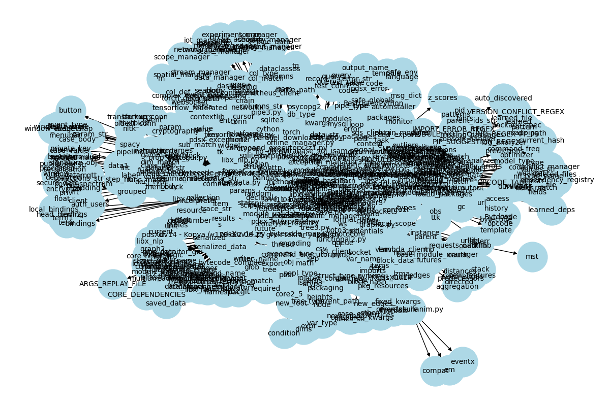
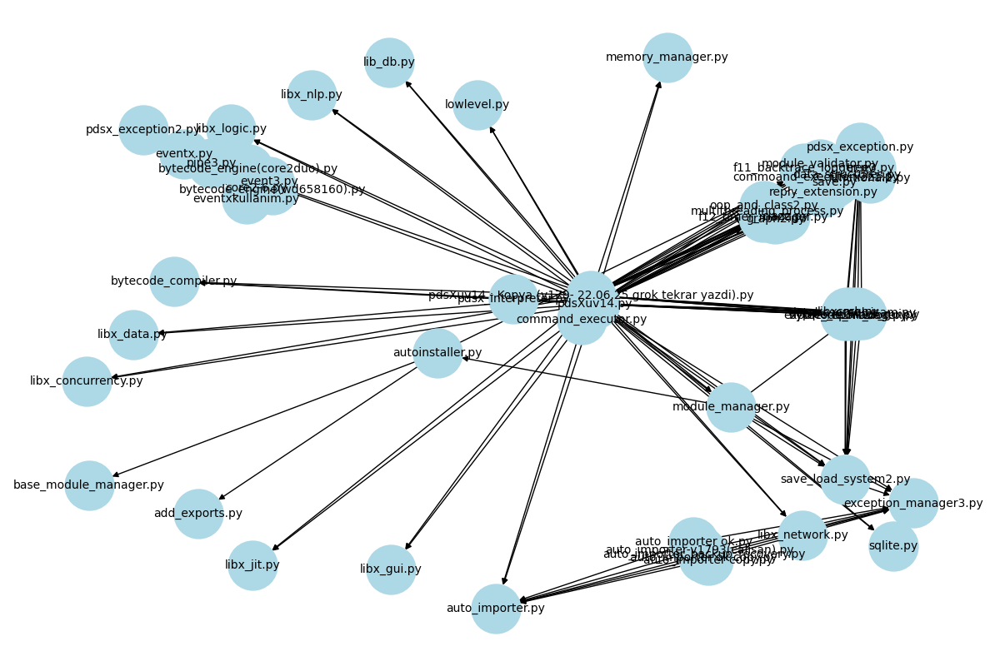
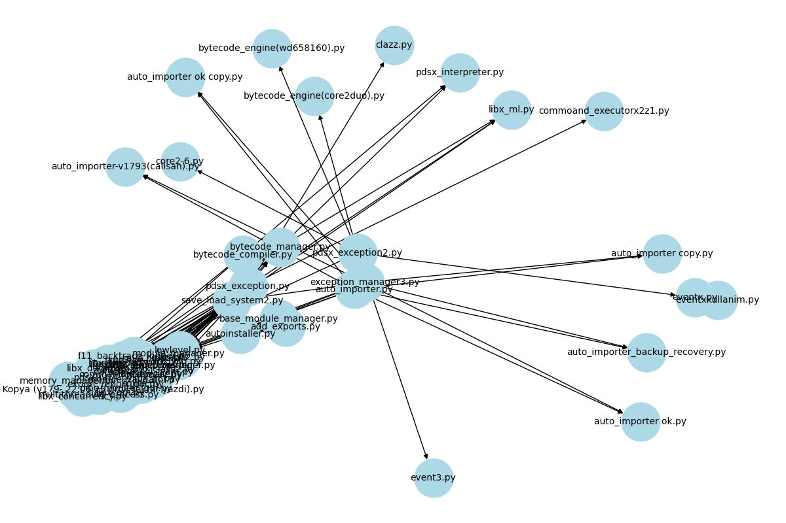

# 📦 MAİS - Modül Bagimlilik Analiz Raporu
- 📁 Klasör: `C:/Users/mete/Zotero/basic/pdsXuv14`
- 📅 Tarih: 2025-06-24 15:48:12
- 🧮 Toplam modül sayısı: 82

## 🔗 Zincir Bağlantıları (chains.txt)
| Kaynak | Hedef |
|--------|--------|
| `add_exports.py` | `re` |
| `add_exports.py` | `func` |
| `add_exports.py` | `f` |
| `add_exports.py` | `ast` |
| `add_exports.py` | `typing` |
| `add_exports.py` | `os` |
| `ai.py` | `json` |
| `ai.py` | `numpy` |
| `ai.py` | `importer` |
| `ai.py` | `argparse` |
| `ai.py` | `datetime` |
| `ai.py` | `sys` |
| `ai.py` | `self` |
| `ai.py` | `sklearn` |
| `ai.py` | `handler` |
| `ai.py` | `PIP_SUGGESTION_REGEX` |
| `ai.py` | `log_file` |
| `ai.py` | `logger` |
| `ai.py` | `f` |
| `ai.py` | `loop` |
| `ai.py` | `typing` |
| `ai.py` | `old_backup` |
| `ai.py` | `level` |
| `ai.py` | `CACHE_DIR` |
| `ai.py` | `asyncio` |
| `ai.py` | `threading` |
| `ai.py` | `re` |
| `ai.py` | `subprocess` |
| `ai.py` | `shutil` |
| `ai.py` | `dependencies` |
| `ai.py` | `pathlib` |
| `ai.py` | `logging` |
| `ai.py` | `console_handler` |
| `ai.py` | `output` |
| `ai.py` | `current_time` |
| `ai.py` | `metadata` |
| `ai.py` | `dot` |
| `ai.py` | `hashlib` |
| `ai.py` | `backup_file` |
| `ai.py` | `env_manager` |
| `ai.py` | `ver` |
| `ai.py` | `message` |
| `ai.py` | `graphviz` |
| `ai.py` | `time` |
| `ai.py` | `importlib` |
| `ai.py` | `LOG_DIR` |
| `ai.py` | `MODULE_SPECIFIC_DEPS` |
| `ai.py` | `elasticsearch` |
| `ai.py` | `IMPORT_ERROR_REGEX` |
| `ai.py` | `atexit` |
| `ai.py` | `task` |
| `ai.py` | `x` |
| `ai.py` | `package` |
| `ai.py` | `data` |
| `ai.py` | `os` |
| `ai.py` | `psutil` |
| `ai.py` | `match` |
| `ai.py` | `winreg` |
| `ai.py` | `keyboard` |
| `ai.py` | `elapsed` |
| `ai.py` | `colorama` |
| `ai.py` | `shutdown_manager` |
| `ai.py` | `cache_file` |
| `ai.py` | `concurrent` |
| `ai.py` | `process` |
| `ai.py` | `signal` |
| `ai.py` | `collections` |
| `ai.py` | `new_handler` |
| `ai.py` | `MODULE_NOT_FOUND_REGEX` |
| `autoinstaller.py` | `json` |
| `autoinstaller.py` | `datetime` |
| `autoinstaller.py` | `sys` |
| `autoinstaller.py` | `self` |
| `autoinstaller.py` | `handler` |
| `autoinstaller.py` | `logger` |
| `autoinstaller.py` | `f` |
| `autoinstaller.py` | `typing` |
| `autoinstaller.py` | `ast` |
| `autoinstaller.py` | `exports` |
| `autoinstaller.py` | `executor` |
| `autoinstaller.py` | `p` |
| `autoinstaller.py` | `re` |
| `autoinstaller.py` | `threading` |
| `autoinstaller.py` | `subprocess` |
| `autoinstaller.py` | `pdsx_exception` |
| `autoinstaller.py` | `shutil` |
| `autoinstaller.py` | `dependencies` |
| `autoinstaller.py` | `pathlib` |
| `autoinstaller.py` | `log` |
| `autoinstaller.py` | `venv` |
| `autoinstaller.py` | `func` |
| `autoinstaller.py` | `cmd` |
| `autoinstaller.py` | `logging` |
| `autoinstaller.py` | `base_module_manager` |
| `autoinstaller.py` | `required_packages` |
| `autoinstaller.py` | `imports` |
| `autoinstaller.py` | `future` |
| `autoinstaller.py` | `package` |
| `autoinstaller.py` | `futures` |
| `autoinstaller.py` | `data` |
| `autoinstaller.py` | `os` |
| `autoinstaller.py` | `match` |
| `autoinstaller.py` | `add_exports` |
| `autoinstaller.py` | `concurrent` |
| `autoinstaller.py` | `conflicts` |
| `autoinstaller.py` | `deps` |
| `auto_importer copy.py` | `sys` |
| `auto_importer copy.py` | `handler` |
| `auto_importer copy.py` | `logger` |
| `auto_importer copy.py` | `found_packages` |
| `auto_importer copy.py` | `level` |
| `auto_importer copy.py` | `asyncio` |
| `auto_importer copy.py` | `re` |
| `auto_importer copy.py` | `clf` |
| `auto_importer copy.py` | `subprocess` |
| `auto_importer copy.py` | `real_time_monitor` |
| `auto_importer copy.py` | `module_mappings` |
| `auto_importer copy.py` | `metadata` |
| `auto_importer copy.py` | `LAST_ARGS_FILE` |
| `auto_importer copy.py` | `optimized` |
| `auto_importer copy.py` | `env_manager` |
| `auto_importer copy.py` | `time` |
| `auto_importer copy.py` | `elasticsearch` |
| `auto_importer copy.py` | `last_args_data` |
| `auto_importer copy.py` | `os` |
| `auto_importer copy.py` | `line` |
| `auto_importer copy.py` | `issue` |
| `auto_importer copy.py` | `match` |
| `auto_importer copy.py` | `terminal_output` |
| `auto_importer copy.py` | `colorama` |
| `auto_importer copy.py` | `part` |
| `auto_importer copy.py` | `process` |
| `auto_importer copy.py` | `recommendations` |
| `auto_importer copy.py` | `version` |
| `auto_importer copy.py` | `terminal_analyzer` |
| `auto_importer copy.py` | `numpy` |
| `auto_importer copy.py` | `argparse` |
| `auto_importer copy.py` | `traceback` |
| `auto_importer copy.py` | `sklearn` |
| `auto_importer copy.py` | `issues` |
| `auto_importer copy.py` | `f` |
| `auto_importer copy.py` | `v` |
| `auto_importer copy.py` | `old_backup` |
| `auto_importer copy.py` | `module_match` |
| `auto_importer copy.py` | `temp` |
| `auto_importer copy.py` | `shutil` |
| `auto_importer copy.py` | `pathlib` |
| `auto_importer copy.py` | `logging` |
| `auto_importer copy.py` | `import_match` |
| `auto_importer copy.py` | `duration` |
| `auto_importer copy.py` | `auto_importer` |
| `auto_importer copy.py` | `install_args` |
| `auto_importer copy.py` | `message` |
| `auto_importer copy.py` | `validation_chain` |
| `auto_importer copy.py` | `importlib` |
| `auto_importer copy.py` | `package` |
| `auto_importer copy.py` | `np` |
| `auto_importer copy.py` | `invalid_modules` |
| `auto_importer copy.py` | `pip_match` |
| `auto_importer copy.py` | `psutil` |
| `auto_importer copy.py` | `e` |
| `auto_importer copy.py` | `winreg` |
| `auto_importer copy.py` | `failure` |
| `auto_importer copy.py` | `elapsed` |
| `auto_importer copy.py` | `dependency_errors` |
| `auto_importer copy.py` | `content` |
| `auto_importer copy.py` | `outliers` |
| `auto_importer copy.py` | `conflicts` |
| `auto_importer copy.py` | `new_handler` |
| `auto_importer copy.py` | `underloaded` |
| `auto_importer copy.py` | `visited` |
| `auto_importer copy.py` | `log_content` |
| `auto_importer copy.py` | `datetime` |
| `auto_importer copy.py` | `self` |
| `auto_importer copy.py` | `log_file` |
| `auto_importer copy.py` | `sorted_plan` |
| `auto_importer copy.py` | `typing` |
| `auto_importer copy.py` | `CACHE_DIR` |
| `auto_importer copy.py` | `y` |
| `auto_importer copy.py` | `module_name` |
| `auto_importer copy.py` | `threading` |
| `auto_importer copy.py` | `conflict` |
| `auto_importer copy.py` | `module_deps` |
| `auto_importer copy.py` | `dep` |
| `auto_importer copy.py` | `module` |
| `auto_importer copy.py` | `parser` |
| `auto_importer copy.py` | `output` |
| `auto_importer copy.py` | `pkg` |
| `auto_importer copy.py` | `current_time` |
| `auto_importer copy.py` | `ver` |
| `auto_importer copy.py` | `installation_plan` |
| `auto_importer copy.py` | `LOG_DIR` |
| `auto_importer copy.py` | `overloaded` |
| `auto_importer copy.py` | `atexit` |
| `auto_importer copy.py` | `missing_modules` |
| `auto_importer copy.py` | `cache_file` |
| `auto_importer copy.py` | `suggestions` |
| `auto_importer copy.py` | `cmd` |
| `auto_importer copy.py` | `json` |
| `auto_importer copy.py` | `importer` |
| `auto_importer copy.py` | `graph` |
| `auto_importer copy.py` | `X` |
| `auto_importer copy.py` | `normalized` |
| `auto_importer copy.py` | `dot` |
| `auto_importer copy.py` | `hashlib` |
| `auto_importer copy.py` | `backup_file` |
| `auto_importer copy.py` | `graphviz` |
| `auto_importer copy.py` | `MODULE_SPECIFIC_DEPS` |
| `auto_importer copy.py` | `x` |
| `auto_importer copy.py` | `terminal_log_file` |
| `auto_importer copy.py` | `data` |
| `auto_importer copy.py` | `version_match` |
| `auto_importer copy.py` | `exception_manager3` |
| `auto_importer copy.py` | `keyboard` |
| `auto_importer copy.py` | `valid_modules` |
| `auto_importer copy.py` | `shutdown_manager` |
| `auto_importer copy.py` | `signal` |
| `auto_importer copy.py` | `collections` |
| `auto_importer copy.py` | `resolutions` |
| `auto_importer ok copy.py` | `sys` |
| `auto_importer ok copy.py` | `handler` |
| `auto_importer ok copy.py` | `found_packages` |
| `auto_importer ok copy.py` | `level` |
| `auto_importer ok copy.py` | `asyncio` |
| `auto_importer ok copy.py` | `re` |
| `auto_importer ok copy.py` | `clf` |
| `auto_importer ok copy.py` | `subprocess` |
| `auto_importer ok copy.py` | `real_time_monitor` |
| `auto_importer ok copy.py` | `module_mappings` |
| `auto_importer ok copy.py` | `metadata` |
| `auto_importer ok copy.py` | `LAST_ARGS_FILE` |
| `auto_importer ok copy.py` | `optimized` |
| `auto_importer ok copy.py` | `env_manager` |
| `auto_importer ok copy.py` | `time` |
| `auto_importer ok copy.py` | `elasticsearch` |
| `auto_importer ok copy.py` | `last_args_data` |
| `auto_importer ok copy.py` | `os` |
| `auto_importer ok copy.py` | `line` |
| `auto_importer ok copy.py` | `issue` |
| `auto_importer ok copy.py` | `match` |
| `auto_importer ok copy.py` | `terminal_output` |
| `auto_importer ok copy.py` | `colorama` |
| `auto_importer ok copy.py` | `part` |
| `auto_importer ok copy.py` | `process` |
| `auto_importer ok copy.py` | `recommendations` |
| `auto_importer ok copy.py` | `version` |
| `auto_importer ok copy.py` | `terminal_analyzer` |
| `auto_importer ok copy.py` | `numpy` |
| `auto_importer ok copy.py` | `argparse` |
| `auto_importer ok copy.py` | `traceback` |
| `auto_importer ok copy.py` | `sklearn` |
| `auto_importer ok copy.py` | `issues` |
| `auto_importer ok copy.py` | `f` |
| `auto_importer ok copy.py` | `v` |
| `auto_importer ok copy.py` | `old_backup` |
| `auto_importer ok copy.py` | `module_match` |
| `auto_importer ok copy.py` | `temp` |
| `auto_importer ok copy.py` | `shutil` |
| `auto_importer ok copy.py` | `pathlib` |
| `auto_importer ok copy.py` | `logging` |
| `auto_importer ok copy.py` | `import_match` |
| `auto_importer ok copy.py` | `auto_importer` |
| `auto_importer ok copy.py` | `install_args` |
| `auto_importer ok copy.py` | `message` |
| `auto_importer ok copy.py` | `validation_chain` |
| `auto_importer ok copy.py` | `importlib` |
| `auto_importer ok copy.py` | `package` |
| `auto_importer ok copy.py` | `np` |
| `auto_importer ok copy.py` | `invalid_modules` |
| `auto_importer ok copy.py` | `pip_match` |
| `auto_importer ok copy.py` | `psutil` |
| `auto_importer ok copy.py` | `e` |
| `auto_importer ok copy.py` | `winreg` |
| `auto_importer ok copy.py` | `failure` |
| `auto_importer ok copy.py` | `elapsed` |
| `auto_importer ok copy.py` | `dependency_errors` |
| `auto_importer ok copy.py` | `content` |
| `auto_importer ok copy.py` | `outliers` |
| `auto_importer ok copy.py` | `conflicts` |
| `auto_importer ok copy.py` | `new_handler` |
| `auto_importer ok copy.py` | `underloaded` |
| `auto_importer ok copy.py` | `visited` |
| `auto_importer ok copy.py` | `log_content` |
| `auto_importer ok copy.py` | `datetime` |
| `auto_importer ok copy.py` | `self` |
| `auto_importer ok copy.py` | `log_file` |
| `auto_importer ok copy.py` | `sorted_plan` |
| `auto_importer ok copy.py` | `typing` |
| `auto_importer ok copy.py` | `CACHE_DIR` |
| `auto_importer ok copy.py` | `y` |
| `auto_importer ok copy.py` | `module_name` |
| `auto_importer ok copy.py` | `threading` |
| `auto_importer ok copy.py` | `conflict` |
| `auto_importer ok copy.py` | `module_deps` |
| `auto_importer ok copy.py` | `dep` |
| `auto_importer ok copy.py` | `module` |
| `auto_importer ok copy.py` | `parser` |
| `auto_importer ok copy.py` | `output` |
| `auto_importer ok copy.py` | `pkg` |
| `auto_importer ok copy.py` | `current_time` |
| `auto_importer ok copy.py` | `ver` |
| `auto_importer ok copy.py` | `installation_plan` |
| `auto_importer ok copy.py` | `LOG_DIR` |
| `auto_importer ok copy.py` | `overloaded` |
| `auto_importer ok copy.py` | `atexit` |
| `auto_importer ok copy.py` | `missing_modules` |
| `auto_importer ok copy.py` | `cache_file` |
| `auto_importer ok copy.py` | `suggestions` |
| `auto_importer ok copy.py` | `cmd` |
| `auto_importer ok copy.py` | `json` |
| `auto_importer ok copy.py` | `importer` |
| `auto_importer ok copy.py` | `graph` |
| `auto_importer ok copy.py` | `X` |
| `auto_importer ok copy.py` | `normalized` |
| `auto_importer ok copy.py` | `dot` |
| `auto_importer ok copy.py` | `hashlib` |
| `auto_importer ok copy.py` | `backup_file` |
| `auto_importer ok copy.py` | `graphviz` |
| `auto_importer ok copy.py` | `MODULE_SPECIFIC_DEPS` |
| `auto_importer ok copy.py` | `x` |
| `auto_importer ok copy.py` | `terminal_log_file` |
| `auto_importer ok copy.py` | `data` |
| `auto_importer ok copy.py` | `version_match` |
| `auto_importer ok copy.py` | `exception_manager3` |
| `auto_importer ok copy.py` | `keyboard` |
| `auto_importer ok copy.py` | `valid_modules` |
| `auto_importer ok copy.py` | `shutdown_manager` |
| `auto_importer ok copy.py` | `signal` |
| `auto_importer ok copy.py` | `collections` |
| `auto_importer ok copy.py` | `resolutions` |
| `auto_importer ok.py` | `sys` |
| `auto_importer ok.py` | `handler` |
| `auto_importer ok.py` | `found_packages` |
| `auto_importer ok.py` | `level` |
| `auto_importer ok.py` | `asyncio` |
| `auto_importer ok.py` | `re` |
| `auto_importer ok.py` | `clf` |
| `auto_importer ok.py` | `subprocess` |
| `auto_importer ok.py` | `real_time_monitor` |
| `auto_importer ok.py` | `module_mappings` |
| `auto_importer ok.py` | `metadata` |
| `auto_importer ok.py` | `LAST_ARGS_FILE` |
| `auto_importer ok.py` | `optimized` |
| `auto_importer ok.py` | `env_manager` |
| `auto_importer ok.py` | `time` |
| `auto_importer ok.py` | `elasticsearch` |
| `auto_importer ok.py` | `last_args_data` |
| `auto_importer ok.py` | `os` |
| `auto_importer ok.py` | `line` |
| `auto_importer ok.py` | `issue` |
| `auto_importer ok.py` | `match` |
| `auto_importer ok.py` | `terminal_output` |
| `auto_importer ok.py` | `colorama` |
| `auto_importer ok.py` | `part` |
| `auto_importer ok.py` | `process` |
| `auto_importer ok.py` | `recommendations` |
| `auto_importer ok.py` | `version` |
| `auto_importer ok.py` | `terminal_analyzer` |
| `auto_importer ok.py` | `numpy` |
| `auto_importer ok.py` | `argparse` |
| `auto_importer ok.py` | `traceback` |
| `auto_importer ok.py` | `sklearn` |
| `auto_importer ok.py` | `issues` |
| `auto_importer ok.py` | `f` |
| `auto_importer ok.py` | `v` |
| `auto_importer ok.py` | `old_backup` |
| `auto_importer ok.py` | `module_match` |
| `auto_importer ok.py` | `temp` |
| `auto_importer ok.py` | `shutil` |
| `auto_importer ok.py` | `pathlib` |
| `auto_importer ok.py` | `logging` |
| `auto_importer ok.py` | `import_match` |
| `auto_importer ok.py` | `auto_importer` |
| `auto_importer ok.py` | `install_args` |
| `auto_importer ok.py` | `message` |
| `auto_importer ok.py` | `validation_chain` |
| `auto_importer ok.py` | `importlib` |
| `auto_importer ok.py` | `package` |
| `auto_importer ok.py` | `np` |
| `auto_importer ok.py` | `invalid_modules` |
| `auto_importer ok.py` | `pip_match` |
| `auto_importer ok.py` | `psutil` |
| `auto_importer ok.py` | `e` |
| `auto_importer ok.py` | `winreg` |
| `auto_importer ok.py` | `failure` |
| `auto_importer ok.py` | `elapsed` |
| `auto_importer ok.py` | `dependency_errors` |
| `auto_importer ok.py` | `content` |
| `auto_importer ok.py` | `outliers` |
| `auto_importer ok.py` | `conflicts` |
| `auto_importer ok.py` | `new_handler` |
| `auto_importer ok.py` | `underloaded` |
| `auto_importer ok.py` | `visited` |
| `auto_importer ok.py` | `log_content` |
| `auto_importer ok.py` | `datetime` |
| `auto_importer ok.py` | `self` |
| `auto_importer ok.py` | `log_file` |
| `auto_importer ok.py` | `sorted_plan` |
| `auto_importer ok.py` | `typing` |
| `auto_importer ok.py` | `CACHE_DIR` |
| `auto_importer ok.py` | `y` |
| `auto_importer ok.py` | `module_name` |
| `auto_importer ok.py` | `threading` |
| `auto_importer ok.py` | `conflict` |
| `auto_importer ok.py` | `module_deps` |
| `auto_importer ok.py` | `dep` |
| `auto_importer ok.py` | `module` |
| `auto_importer ok.py` | `parser` |
| `auto_importer ok.py` | `output` |
| `auto_importer ok.py` | `pkg` |
| `auto_importer ok.py` | `current_time` |
| `auto_importer ok.py` | `ver` |
| `auto_importer ok.py` | `installation_plan` |
| `auto_importer ok.py` | `LOG_DIR` |
| `auto_importer ok.py` | `overloaded` |
| `auto_importer ok.py` | `atexit` |
| `auto_importer ok.py` | `missing_modules` |
| `auto_importer ok.py` | `cache_file` |
| `auto_importer ok.py` | `suggestions` |
| `auto_importer ok.py` | `cmd` |
| `auto_importer ok.py` | `json` |
| `auto_importer ok.py` | `importer` |
| `auto_importer ok.py` | `graph` |
| `auto_importer ok.py` | `X` |
| `auto_importer ok.py` | `normalized` |
| `auto_importer ok.py` | `dot` |
| `auto_importer ok.py` | `hashlib` |
| `auto_importer ok.py` | `backup_file` |
| `auto_importer ok.py` | `graphviz` |
| `auto_importer ok.py` | `MODULE_SPECIFIC_DEPS` |
| `auto_importer ok.py` | `x` |
| `auto_importer ok.py` | `terminal_log_file` |
| `auto_importer ok.py` | `data` |
| `auto_importer ok.py` | `version_match` |
| `auto_importer ok.py` | `exception_manager3` |
| `auto_importer ok.py` | `keyboard` |
| `auto_importer ok.py` | `valid_modules` |
| `auto_importer ok.py` | `shutdown_manager` |
| `auto_importer ok.py` | `signal` |
| `auto_importer ok.py` | `collections` |
| `auto_importer ok.py` | `resolutions` |
| `auto_importer-v1793(calisan).py` | `sys` |
| `auto_importer-v1793(calisan).py` | `handler` |
| `auto_importer-v1793(calisan).py` | `logger` |
| `auto_importer-v1793(calisan).py` | `found_packages` |
| `auto_importer-v1793(calisan).py` | `level` |
| `auto_importer-v1793(calisan).py` | `asyncio` |
| `auto_importer-v1793(calisan).py` | `re` |
| `auto_importer-v1793(calisan).py` | `clf` |
| `auto_importer-v1793(calisan).py` | `subprocess` |
| `auto_importer-v1793(calisan).py` | `real_time_monitor` |
| `auto_importer-v1793(calisan).py` | `module_mappings` |
| `auto_importer-v1793(calisan).py` | `metadata` |
| `auto_importer-v1793(calisan).py` | `optimized` |
| `auto_importer-v1793(calisan).py` | `env_manager` |
| `auto_importer-v1793(calisan).py` | `time` |
| `auto_importer-v1793(calisan).py` | `elasticsearch` |
| `auto_importer-v1793(calisan).py` | `os` |
| `auto_importer-v1793(calisan).py` | `line` |
| `auto_importer-v1793(calisan).py` | `issue` |
| `auto_importer-v1793(calisan).py` | `match` |
| `auto_importer-v1793(calisan).py` | `colorama` |
| `auto_importer-v1793(calisan).py` | `part` |
| `auto_importer-v1793(calisan).py` | `process` |
| `auto_importer-v1793(calisan).py` | `recommendations` |
| `auto_importer-v1793(calisan).py` | `version` |
| `auto_importer-v1793(calisan).py` | `numpy` |
| `auto_importer-v1793(calisan).py` | `argparse` |
| `auto_importer-v1793(calisan).py` | `traceback` |
| `auto_importer-v1793(calisan).py` | `sklearn` |
| `auto_importer-v1793(calisan).py` | `issues` |
| `auto_importer-v1793(calisan).py` | `f` |
| `auto_importer-v1793(calisan).py` | `v` |
| `auto_importer-v1793(calisan).py` | `old_backup` |
| `auto_importer-v1793(calisan).py` | `module_match` |
| `auto_importer-v1793(calisan).py` | `temp` |
| `auto_importer-v1793(calisan).py` | `shutil` |
| `auto_importer-v1793(calisan).py` | `pathlib` |
| `auto_importer-v1793(calisan).py` | `logging` |
| `auto_importer-v1793(calisan).py` | `import_match` |
| `auto_importer-v1793(calisan).py` | `log_analyzer` |
| `auto_importer-v1793(calisan).py` | `auto_importer` |
| `auto_importer-v1793(calisan).py` | `install_args` |
| `auto_importer-v1793(calisan).py` | `message` |
| `auto_importer-v1793(calisan).py` | `validation_chain` |
| `auto_importer-v1793(calisan).py` | `importlib` |
| `auto_importer-v1793(calisan).py` | `package` |
| `auto_importer-v1793(calisan).py` | `np` |
| `auto_importer-v1793(calisan).py` | `invalid_modules` |
| `auto_importer-v1793(calisan).py` | `pip_match` |
| `auto_importer-v1793(calisan).py` | `psutil` |
| `auto_importer-v1793(calisan).py` | `e` |
| `auto_importer-v1793(calisan).py` | `winreg` |
| `auto_importer-v1793(calisan).py` | `elapsed` |
| `auto_importer-v1793(calisan).py` | `content` |
| `auto_importer-v1793(calisan).py` | `concurrent` |
| `auto_importer-v1793(calisan).py` | `outliers` |
| `auto_importer-v1793(calisan).py` | `conflicts` |
| `auto_importer-v1793(calisan).py` | `new_handler` |
| `auto_importer-v1793(calisan).py` | `underloaded` |
| `auto_importer-v1793(calisan).py` | `visited` |
| `auto_importer-v1793(calisan).py` | `datetime` |
| `auto_importer-v1793(calisan).py` | `self` |
| `auto_importer-v1793(calisan).py` | `log_file` |
| `auto_importer-v1793(calisan).py` | `sorted_plan` |
| `auto_importer-v1793(calisan).py` | `typing` |
| `auto_importer-v1793(calisan).py` | `CACHE_DIR` |
| `auto_importer-v1793(calisan).py` | `y` |
| `auto_importer-v1793(calisan).py` | `module_name` |
| `auto_importer-v1793(calisan).py` | `threading` |
| `auto_importer-v1793(calisan).py` | `module_deps` |
| `auto_importer-v1793(calisan).py` | `error` |
| `auto_importer-v1793(calisan).py` | `dep` |
| `auto_importer-v1793(calisan).py` | `module` |
| `auto_importer-v1793(calisan).py` | `parser` |
| `auto_importer-v1793(calisan).py` | `output` |
| `auto_importer-v1793(calisan).py` | `pkg` |
| `auto_importer-v1793(calisan).py` | `current_time` |
| `auto_importer-v1793(calisan).py` | `ver` |
| `auto_importer-v1793(calisan).py` | `installation_plan` |
| `auto_importer-v1793(calisan).py` | `LOG_DIR` |
| `auto_importer-v1793(calisan).py` | `overloaded` |
| `auto_importer-v1793(calisan).py` | `atexit` |
| `auto_importer-v1793(calisan).py` | `missing_modules` |
| `auto_importer-v1793(calisan).py` | `packages` |
| `auto_importer-v1793(calisan).py` | `cache_file` |
| `auto_importer-v1793(calisan).py` | `suggestions` |
| `auto_importer-v1793(calisan).py` | `cmd` |
| `auto_importer-v1793(calisan).py` | `json` |
| `auto_importer-v1793(calisan).py` | `importer` |
| `auto_importer-v1793(calisan).py` | `graph` |
| `auto_importer-v1793(calisan).py` | `X` |
| `auto_importer-v1793(calisan).py` | `normalized` |
| `auto_importer-v1793(calisan).py` | `missing_packages` |
| `auto_importer-v1793(calisan).py` | `dot` |
| `auto_importer-v1793(calisan).py` | `hashlib` |
| `auto_importer-v1793(calisan).py` | `backup_file` |
| `auto_importer-v1793(calisan).py` | `stderr` |
| `auto_importer-v1793(calisan).py` | `graphviz` |
| `auto_importer-v1793(calisan).py` | `MODULE_SPECIFIC_DEPS` |
| `auto_importer-v1793(calisan).py` | `x` |
| `auto_importer-v1793(calisan).py` | `terminal_log_file` |
| `auto_importer-v1793(calisan).py` | `version_match` |
| `auto_importer-v1793(calisan).py` | `exception_manager3` |
| `auto_importer-v1793(calisan).py` | `keyboard` |
| `auto_importer-v1793(calisan).py` | `valid_modules` |
| `auto_importer-v1793(calisan).py` | `shutdown_manager` |
| `auto_importer-v1793(calisan).py` | `signal` |
| `auto_importer-v1793(calisan).py` | `collections` |
| `auto_importer-v1793(calisan).py` | `resolutions` |
| `auto_importer_backup_recovery.py` | `sys` |
| `auto_importer_backup_recovery.py` | `handler` |
| `auto_importer_backup_recovery.py` | `found_packages` |
| `auto_importer_backup_recovery.py` | `level` |
| `auto_importer_backup_recovery.py` | `asyncio` |
| `auto_importer_backup_recovery.py` | `re` |
| `auto_importer_backup_recovery.py` | `clf` |
| `auto_importer_backup_recovery.py` | `subprocess` |
| `auto_importer_backup_recovery.py` | `real_time_monitor` |
| `auto_importer_backup_recovery.py` | `module_mappings` |
| `auto_importer_backup_recovery.py` | `metadata` |
| `auto_importer_backup_recovery.py` | `LAST_ARGS_FILE` |
| `auto_importer_backup_recovery.py` | `optimized` |
| `auto_importer_backup_recovery.py` | `env_manager` |
| `auto_importer_backup_recovery.py` | `time` |
| `auto_importer_backup_recovery.py` | `elasticsearch` |
| `auto_importer_backup_recovery.py` | `last_args_data` |
| `auto_importer_backup_recovery.py` | `os` |
| `auto_importer_backup_recovery.py` | `line` |
| `auto_importer_backup_recovery.py` | `issue` |
| `auto_importer_backup_recovery.py` | `match` |
| `auto_importer_backup_recovery.py` | `terminal_output` |
| `auto_importer_backup_recovery.py` | `colorama` |
| `auto_importer_backup_recovery.py` | `part` |
| `auto_importer_backup_recovery.py` | `process` |
| `auto_importer_backup_recovery.py` | `recommendations` |
| `auto_importer_backup_recovery.py` | `version` |
| `auto_importer_backup_recovery.py` | `terminal_analyzer` |
| `auto_importer_backup_recovery.py` | `numpy` |
| `auto_importer_backup_recovery.py` | `argparse` |
| `auto_importer_backup_recovery.py` | `traceback` |
| `auto_importer_backup_recovery.py` | `sklearn` |
| `auto_importer_backup_recovery.py` | `issues` |
| `auto_importer_backup_recovery.py` | `f` |
| `auto_importer_backup_recovery.py` | `v` |
| `auto_importer_backup_recovery.py` | `old_backup` |
| `auto_importer_backup_recovery.py` | `module_match` |
| `auto_importer_backup_recovery.py` | `temp` |
| `auto_importer_backup_recovery.py` | `shutil` |
| `auto_importer_backup_recovery.py` | `pathlib` |
| `auto_importer_backup_recovery.py` | `logging` |
| `auto_importer_backup_recovery.py` | `import_match` |
| `auto_importer_backup_recovery.py` | `auto_importer` |
| `auto_importer_backup_recovery.py` | `install_args` |
| `auto_importer_backup_recovery.py` | `message` |
| `auto_importer_backup_recovery.py` | `validation_chain` |
| `auto_importer_backup_recovery.py` | `importlib` |
| `auto_importer_backup_recovery.py` | `package` |
| `auto_importer_backup_recovery.py` | `np` |
| `auto_importer_backup_recovery.py` | `invalid_modules` |
| `auto_importer_backup_recovery.py` | `pip_match` |
| `auto_importer_backup_recovery.py` | `psutil` |
| `auto_importer_backup_recovery.py` | `e` |
| `auto_importer_backup_recovery.py` | `winreg` |
| `auto_importer_backup_recovery.py` | `failure` |
| `auto_importer_backup_recovery.py` | `elapsed` |
| `auto_importer_backup_recovery.py` | `dependency_errors` |
| `auto_importer_backup_recovery.py` | `content` |
| `auto_importer_backup_recovery.py` | `outliers` |
| `auto_importer_backup_recovery.py` | `conflicts` |
| `auto_importer_backup_recovery.py` | `new_handler` |
| `auto_importer_backup_recovery.py` | `underloaded` |
| `auto_importer_backup_recovery.py` | `visited` |
| `auto_importer_backup_recovery.py` | `log_content` |
| `auto_importer_backup_recovery.py` | `datetime` |
| `auto_importer_backup_recovery.py` | `self` |
| `auto_importer_backup_recovery.py` | `log_file` |
| `auto_importer_backup_recovery.py` | `sorted_plan` |
| `auto_importer_backup_recovery.py` | `typing` |
| `auto_importer_backup_recovery.py` | `CACHE_DIR` |
| `auto_importer_backup_recovery.py` | `y` |
| `auto_importer_backup_recovery.py` | `module_name` |
| `auto_importer_backup_recovery.py` | `threading` |
| `auto_importer_backup_recovery.py` | `conflict` |
| `auto_importer_backup_recovery.py` | `module_deps` |
| `auto_importer_backup_recovery.py` | `dep` |
| `auto_importer_backup_recovery.py` | `module` |
| `auto_importer_backup_recovery.py` | `parser` |
| `auto_importer_backup_recovery.py` | `output` |
| `auto_importer_backup_recovery.py` | `pkg` |
| `auto_importer_backup_recovery.py` | `current_time` |
| `auto_importer_backup_recovery.py` | `ver` |
| `auto_importer_backup_recovery.py` | `installation_plan` |
| `auto_importer_backup_recovery.py` | `LOG_DIR` |
| `auto_importer_backup_recovery.py` | `overloaded` |
| `auto_importer_backup_recovery.py` | `atexit` |
| `auto_importer_backup_recovery.py` | `missing_modules` |
| `auto_importer_backup_recovery.py` | `cache_file` |
| `auto_importer_backup_recovery.py` | `suggestions` |
| `auto_importer_backup_recovery.py` | `cmd` |
| `auto_importer_backup_recovery.py` | `json` |
| `auto_importer_backup_recovery.py` | `importer` |
| `auto_importer_backup_recovery.py` | `graph` |
| `auto_importer_backup_recovery.py` | `X` |
| `auto_importer_backup_recovery.py` | `normalized` |
| `auto_importer_backup_recovery.py` | `dot` |
| `auto_importer_backup_recovery.py` | `hashlib` |
| `auto_importer_backup_recovery.py` | `backup_file` |
| `auto_importer_backup_recovery.py` | `graphviz` |
| `auto_importer_backup_recovery.py` | `MODULE_SPECIFIC_DEPS` |
| `auto_importer_backup_recovery.py` | `x` |
| `auto_importer_backup_recovery.py` | `terminal_log_file` |
| `auto_importer_backup_recovery.py` | `data` |
| `auto_importer_backup_recovery.py` | `version_match` |
| `auto_importer_backup_recovery.py` | `exception_manager3` |
| `auto_importer_backup_recovery.py` | `keyboard` |
| `auto_importer_backup_recovery.py` | `valid_modules` |
| `auto_importer_backup_recovery.py` | `shutdown_manager` |
| `auto_importer_backup_recovery.py` | `signal` |
| `auto_importer_backup_recovery.py` | `collections` |
| `auto_importer_backup_recovery.py` | `resolutions` |
| `auto_importer_fixed.py` | `json` |
| `auto_importer_fixed.py` | `numpy` |
| `auto_importer_fixed.py` | `importer` |
| `auto_importer_fixed.py` | `datetime` |
| `auto_importer_fixed.py` | `sys` |
| `auto_importer_fixed.py` | `self` |
| `auto_importer_fixed.py` | `sklearn` |
| `auto_importer_fixed.py` | `handler` |
| `auto_importer_fixed.py` | `log_file` |
| `auto_importer_fixed.py` | `logger` |
| `auto_importer_fixed.py` | `f` |
| `auto_importer_fixed.py` | `typing` |
| `auto_importer_fixed.py` | `old_backup` |
| `auto_importer_fixed.py` | `level` |
| `auto_importer_fixed.py` | `CACHE_DIR` |
| `auto_importer_fixed.py` | `asyncio` |
| `auto_importer_fixed.py` | `threading` |
| `auto_importer_fixed.py` | `re` |
| `auto_importer_fixed.py` | `subprocess` |
| `auto_importer_fixed.py` | `shutil` |
| `auto_importer_fixed.py` | `pathlib` |
| `auto_importer_fixed.py` | `logging` |
| `auto_importer_fixed.py` | `output` |
| `auto_importer_fixed.py` | `hashlib` |
| `auto_importer_fixed.py` | `backup_file` |
| `auto_importer_fixed.py` | `env_manager` |
| `auto_importer_fixed.py` | `ver` |
| `auto_importer_fixed.py` | `message` |
| `auto_importer_fixed.py` | `random` |
| `auto_importer_fixed.py` | `graphviz` |
| `auto_importer_fixed.py` | `time` |
| `auto_importer_fixed.py` | `importlib` |
| `auto_importer_fixed.py` | `LOG_DIR` |
| `auto_importer_fixed.py` | `MODULE_SPECIFIC_DEPS` |
| `auto_importer_fixed.py` | `elasticsearch` |
| `auto_importer_fixed.py` | `aiohttp` |
| `auto_importer_fixed.py` | `x` |
| `auto_importer_fixed.py` | `package` |
| `auto_importer_fixed.py` | `os` |
| `auto_importer_fixed.py` | `psutil` |
| `auto_importer_fixed.py` | `winreg` |
| `auto_importer_fixed.py` | `keyboard` |
| `auto_importer_fixed.py` | `elapsed` |
| `auto_importer_fixed.py` | `colorama` |
| `auto_importer_fixed.py` | `concurrent` |
| `auto_importer_fixed.py` | `collections` |
| `auto_importer_fixed.py` | `path` |
| `auto_importer_fixed.py` | `new_handler` |
| `auto_importer_v1795.py` | `sys` |
| `auto_importer_v1795.py` | `handler` |
| `auto_importer_v1795.py` | `logger` |
| `auto_importer_v1795.py` | `loop` |
| `auto_importer_v1795.py` | `level` |
| `auto_importer_v1795.py` | `asyncio` |
| `auto_importer_v1795.py` | `re` |
| `auto_importer_v1795.py` | `clf` |
| `auto_importer_v1795.py` | `subprocess` |
| `auto_importer_v1795.py` | `learned` |
| `auto_importer_v1795.py` | `metadata` |
| `auto_importer_v1795.py` | `LAST_ARGS_FILE` |
| `auto_importer_v1795.py` | `optimized` |
| `auto_importer_v1795.py` | `conflict_manager` |
| `auto_importer_v1795.py` | `env_manager` |
| `auto_importer_v1795.py` | `time` |
| `auto_importer_v1795.py` | `dir_path` |
| `auto_importer_v1795.py` | `VERSION_CONFLICT_REGEX` |
| `auto_importer_v1795.py` | `elasticsearch` |
| `auto_importer_v1795.py` | `os` |
| `auto_importer_v1795.py` | `line` |
| `auto_importer_v1795.py` | `issue` |
| `auto_importer_v1795.py` | `match` |
| `auto_importer_v1795.py` | `colorama` |
| `auto_importer_v1795.py` | `part` |
| `auto_importer_v1795.py` | `process` |
| `auto_importer_v1795.py` | `recommendations` |
| `auto_importer_v1795.py` | `version` |
| `auto_importer_v1795.py` | `MODULE_NOT_FOUND_REGEX` |
| `auto_importer_v1795.py` | `numpy` |
| `auto_importer_v1795.py` | `argparse` |
| `auto_importer_v1795.py` | `sklearn` |
| `auto_importer_v1795.py` | `issues` |
| `auto_importer_v1795.py` | `PIP_SUGGESTION_REGEX` |
| `auto_importer_v1795.py` | `f` |
| `auto_importer_v1795.py` | `v` |
| `auto_importer_v1795.py` | `old_backup` |
| `auto_importer_v1795.py` | `learned_file` |
| `auto_importer_v1795.py` | `monitor` |
| `auto_importer_v1795.py` | `temp` |
| `auto_importer_v1795.py` | `shutil` |
| `auto_importer_v1795.py` | `dependencies` |
| `auto_importer_v1795.py` | `pathlib` |
| `auto_importer_v1795.py` | `file` |
| `auto_importer_v1795.py` | `logging` |
| `auto_importer_v1795.py` | `install_args` |
| `auto_importer_v1795.py` | `message` |
| `auto_importer_v1795.py` | `validation_chain` |
| `auto_importer_v1795.py` | `importlib` |
| `auto_importer_v1795.py` | `package` |
| `auto_importer_v1795.py` | `np` |
| `auto_importer_v1795.py` | `aiofiles` |
| `auto_importer_v1795.py` | `invalid_modules` |
| `auto_importer_v1795.py` | `psutil` |
| `auto_importer_v1795.py` | `winreg` |
| `auto_importer_v1795.py` | `elapsed` |
| `auto_importer_v1795.py` | `content` |
| `auto_importer_v1795.py` | `concurrent` |
| `auto_importer_v1795.py` | `outliers` |
| `auto_importer_v1795.py` | `conflicts` |
| `auto_importer_v1795.py` | `dependency_registry` |
| `auto_importer_v1795.py` | `new_handler` |
| `auto_importer_v1795.py` | `underloaded` |
| `auto_importer_v1795.py` | `visited` |
| `auto_importer_v1795.py` | `datetime` |
| `auto_importer_v1795.py` | `self` |
| `auto_importer_v1795.py` | `pattern` |
| `auto_importer_v1795.py` | `log_file` |
| `auto_importer_v1795.py` | `typing` |
| `auto_importer_v1795.py` | `CACHE_DIR` |
| `auto_importer_v1795.py` | `y` |
| `auto_importer_v1795.py` | `executor` |
| `auto_importer_v1795.py` | `threading` |
| `auto_importer_v1795.py` | `module_deps` |
| `auto_importer_v1795.py` | `dep` |
| `auto_importer_v1795.py` | `module` |
| `auto_importer_v1795.py` | `parser` |
| `auto_importer_v1795.py` | `console_handler` |
| `auto_importer_v1795.py` | `output` |
| `auto_importer_v1795.py` | `pkg` |
| `auto_importer_v1795.py` | `current_time` |
| `auto_importer_v1795.py` | `current_hash` |
| `auto_importer_v1795.py` | `ver` |
| `auto_importer_v1795.py` | `LOG_DIR` |
| `auto_importer_v1795.py` | `overloaded` |
| `auto_importer_v1795.py` | `IMPORT_ERROR_REGEX` |
| `auto_importer_v1795.py` | `atexit` |
| `auto_importer_v1795.py` | `deleted_files` |
| `auto_importer_v1795.py` | `cache_file` |
| `auto_importer_v1795.py` | `cmd` |
| `auto_importer_v1795.py` | `mapping` |
| `auto_importer_v1795.py` | `json` |
| `auto_importer_v1795.py` | `importer` |
| `auto_importer_v1795.py` | `graph` |
| `auto_importer_v1795.py` | `X` |
| `auto_importer_v1795.py` | `normalized` |
| `auto_importer_v1795.py` | `missing_packages` |
| `auto_importer_v1795.py` | `dot` |
| `auto_importer_v1795.py` | `hashlib` |
| `auto_importer_v1795.py` | `learned_deps` |
| `auto_importer_v1795.py` | `backup_file` |
| `auto_importer_v1795.py` | `graphviz` |
| `auto_importer_v1795.py` | `MODULE_SPECIFIC_DEPS` |
| `auto_importer_v1795.py` | `x` |
| `auto_importer_v1795.py` | `task` |
| `auto_importer_v1795.py` | `data` |
| `auto_importer_v1795.py` | `keyboard` |
| `auto_importer_v1795.py` | `valid_modules` |
| `auto_importer_v1795.py` | `shutdown_manager` |
| `auto_importer_v1795.py` | `package_spec` |
| `auto_importer_v1795.py` | `auto_discovered` |
| `auto_importer_v1795.py` | `signal` |
| `auto_importer_v1795.py` | `collections` |
| `auto_importer_v1795.py` | `resolutions` |
| `base_module_manager.py` | `json` |
| `base_module_manager.py` | `subprocess` |
| `base_module_manager.py` | `shutil` |
| `base_module_manager.py` | `sys` |
| `base_module_manager.py` | `pathlib` |
| `base_module_manager.py` | `self` |
| `base_module_manager.py` | `venv` |
| `base_module_manager.py` | `logging` |
| `base_module_manager.py` | `pkg_resources` |
| `base_module_manager.py` | `typing` |
| `base_module_manager.py` | `os` |
| `bytecode_compiler.py` | `RestrictedPython` |
| `bytecode_compiler.py` | `safe_globals` |
| `bytecode_compiler.py` | `re` |
| `bytecode_compiler.py` | `types` |
| `bytecode_compiler.py` | `self` |
| `bytecode_compiler.py` | `pathlib` |
| `bytecode_compiler.py` | `uuid` |
| `bytecode_compiler.py` | `log` |
| `bytecode_compiler.py` | `logging` |
| `bytecode_compiler.py` | `typing` |
| `bytecode_compiler.py` | `collections` |
| `bytecode_compiler.py` | `ast` |
| `bytecode_compiler.py` | `pickle` |
| `bytecode_engine(core2duo).py` | `json` |
| `bytecode_engine(core2duo).py` | `numpy` |
| `bytecode_engine(core2duo).py` | `cython` |
| `bytecode_engine(core2duo).py` | `gamma_match` |
| `bytecode_engine(core2duo).py` | `pd` |
| `bytecode_engine(core2duo).py` | `decimal` |
| `bytecode_engine(core2duo).py` | `prop_match` |
| `bytecode_engine(core2duo).py` | `omega_match` |
| `bytecode_engine(core2duo).py` | `body` |
| `bytecode_engine(core2duo).py` | `sys` |
| `bytecode_engine(core2duo).py` | `self` |
| `bytecode_engine(core2duo).py` | `pdsx_exception2` |
| `bytecode_engine(core2duo).py` | `v` |
| `bytecode_engine(core2duo).py` | `f` |
| `bytecode_engine(core2duo).py` | `gamma_body` |
| `bytecode_engine(core2duo).py` | `typing` |
| `bytecode_engine(core2duo).py` | `omega_body` |
| `bytecode_engine(core2duo).py` | `values` |
| `bytecode_engine(core2duo).py` | `asyncio` |
| `bytecode_engine(core2duo).py` | `decl_type` |
| `bytecode_engine(core2duo).py` | `p` |
| `bytecode_engine(core2duo).py` | `re` |
| `bytecode_engine(core2duo).py` | `threading` |
| `bytecode_engine(core2duo).py` | `instruction` |
| `bytecode_engine(core2duo).py` | `then_block` |
| `bytecode_engine(core2duo).py` | `pathlib` |
| `bytecode_engine(core2duo).py` | `log` |
| `bytecode_engine(core2duo).py` | `pandas` |
| `bytecode_engine(core2duo).py` | `sub_body` |
| `bytecode_engine(core2duo).py` | `logging` |
| `bytecode_engine(core2duo).py` | `method` |
| `bytecode_engine(core2duo).py` | `var_names` |
| `bytecode_engine(core2duo).py` | `ctypes` |
| `bytecode_engine(core2duo).py` | `func_match` |
| `bytecode_engine(core2duo).py` | `random` |
| `bytecode_engine(core2duo).py` | `time` |
| `bytecode_engine(core2duo).py` | `params` |
| `bytecode_engine(core2duo).py` | `func_body` |
| `bytecode_engine(core2duo).py` | `else_block` |
| `bytecode_engine(core2duo).py` | `np` |
| `bytecode_engine(core2duo).py` | `aiofiles` |
| `bytecode_engine(core2duo).py` | `struct` |
| `bytecode_engine(core2duo).py` | `class_def` |
| `bytecode_engine(core2duo).py` | `aiohttp` |
| `bytecode_engine(core2duo).py` | `session` |
| `bytecode_engine(core2duo).py` | `data` |
| `bytecode_engine(core2duo).py` | `os` |
| `bytecode_engine(core2duo).py` | `line` |
| `bytecode_engine(core2duo).py` | `resp` |
| `bytecode_engine(core2duo).py` | `row` |
| `bytecode_engine(core2duo).py` | `dim_match` |
| `bytecode_engine(core2duo).py` | `sub_match` |
| `bytecode_engine(core2duo).py` | `functools` |
| `bytecode_engine(core2duo).py` | `collections` |
| `bytecode_engine(core2duo).py` | `collection` |
| `bytecode_engine(wd658160).py` | `json` |
| `bytecode_engine(wd658160).py` | `numpy` |
| `bytecode_engine(wd658160).py` | `omega_match` |
| `bytecode_engine(wd658160).py` | `gamma_match` |
| `bytecode_engine(wd658160).py` | `pd` |
| `bytecode_engine(wd658160).py` | `decimal` |
| `bytecode_engine(wd658160).py` | `prop_match` |
| `bytecode_engine(wd658160).py` | `body` |
| `bytecode_engine(wd658160).py` | `sys` |
| `bytecode_engine(wd658160).py` | `self` |
| `bytecode_engine(wd658160).py` | `pdsx_exception2` |
| `bytecode_engine(wd658160).py` | `v` |
| `bytecode_engine(wd658160).py` | `f` |
| `bytecode_engine(wd658160).py` | `gamma_body` |
| `bytecode_engine(wd658160).py` | `typing` |
| `bytecode_engine(wd658160).py` | `omega_body` |
| `bytecode_engine(wd658160).py` | `values` |
| `bytecode_engine(wd658160).py` | `asyncio` |
| `bytecode_engine(wd658160).py` | `decl_type` |
| `bytecode_engine(wd658160).py` | `p` |
| `bytecode_engine(wd658160).py` | `re` |
| `bytecode_engine(wd658160).py` | `threading` |
| `bytecode_engine(wd658160).py` | `instruction` |
| `bytecode_engine(wd658160).py` | `then_block` |
| `bytecode_engine(wd658160).py` | `pathlib` |
| `bytecode_engine(wd658160).py` | `log` |
| `bytecode_engine(wd658160).py` | `pandas` |
| `bytecode_engine(wd658160).py` | `sub_body` |
| `bytecode_engine(wd658160).py` | `logging` |
| `bytecode_engine(wd658160).py` | `method` |
| `bytecode_engine(wd658160).py` | `var_names` |
| `bytecode_engine(wd658160).py` | `ctypes` |
| `bytecode_engine(wd658160).py` | `func_match` |
| `bytecode_engine(wd658160).py` | `random` |
| `bytecode_engine(wd658160).py` | `time` |
| `bytecode_engine(wd658160).py` | `params` |
| `bytecode_engine(wd658160).py` | `func_body` |
| `bytecode_engine(wd658160).py` | `else_block` |
| `bytecode_engine(wd658160).py` | `struct` |
| `bytecode_engine(wd658160).py` | `aiofiles` |
| `bytecode_engine(wd658160).py` | `aiohttp` |
| `bytecode_engine(wd658160).py` | `class_def` |
| `bytecode_engine(wd658160).py` | `np` |
| `bytecode_engine(wd658160).py` | `session` |
| `bytecode_engine(wd658160).py` | `os` |
| `bytecode_engine(wd658160).py` | `line` |
| `bytecode_engine(wd658160).py` | `resp` |
| `bytecode_engine(wd658160).py` | `row` |
| `bytecode_engine(wd658160).py` | `dim_match` |
| `bytecode_engine(wd658160).py` | `sub_match` |
| `bytecode_engine(wd658160).py` | `functools` |
| `bytecode_engine(wd658160).py` | `collections` |
| `bytecode_engine(wd658160).py` | `collection` |
| `bytecode_manager.py` | `json` |
| `bytecode_manager.py` | `numpy` |
| `bytecode_manager.py` | `visited` |
| `bytecode_manager.py` | `OPCODE_TABLE` |
| `bytecode_manager.py` | `sys` |
| `bytecode_manager.py` | `opcode` |
| `bytecode_manager.py` | `sklearn` |
| `bytecode_manager.py` | `self` |
| `bytecode_manager.py` | `bytecode` |
| `bytecode_manager.py` | `typing` |
| `bytecode_manager.py` | `Bytecode` |
| `bytecode_manager.py` | `pickle` |
| `bytecode_manager.py` | `asyncio` |
| `bytecode_manager.py` | `save_load_system2` |
| `bytecode_manager.py` | `re` |
| `bytecode_manager.py` | `threading` |
| `bytecode_manager.py` | `pdsx_exception` |
| `bytecode_manager.py` | `base64` |
| `bytecode_manager.py` | `pathlib` |
| `bytecode_manager.py` | `uuid` |
| `bytecode_manager.py` | `log` |
| `bytecode_manager.py` | `logging` |
| `bytecode_manager.py` | `hashlib` |
| `bytecode_manager.py` | `zlib` |
| `bytecode_manager.py` | `graphviz` |
| `bytecode_manager.py` | `time` |
| `bytecode_manager.py` | `np` |
| `bytecode_manager.py` | `aiofiles` |
| `bytecode_manager.py` | `gzip` |
| `bytecode_manager.py` | `functools` |
| `bytecode_manager.py` | `collections` |
| `clazz.py` | `json` |
| `clazz.py` | `numpy` |
| `clazz.py` | `patterns` |
| `clazz.py` | `visited` |
| `clazz.py` | `obs` |
| `clazz.py` | `self` |
| `clazz.py` | `type_registry` |
| `clazz.py` | `sklearn` |
| `clazz.py` | `format_type` |
| `clazz.py` | `f` |
| `clazz.py` | `typing` |
| `clazz.py` | `pickle` |
| `clazz.py` | `asyncio` |
| `clazz.py` | `plugin_modules` |
| `clazz.py` | `name` |
| `clazz.py` | `threading` |
| `clazz.py` | `re` |
| `clazz.py` | `pdsx_exception` |
| `clazz.py` | `base64` |
| `clazz.py` | `pathlib` |
| `clazz.py` | `uuid` |
| `clazz.py` | `log` |
| `clazz.py` | `command_upper` |
| `clazz.py` | `logging` |
| `clazz.py` | `method` |
| `clazz.py` | `AES` |
| `clazz.py` | `dot` |
| `clazz.py` | `hashlib` |
| `clazz.py` | `hints` |
| `clazz.py` | `local_scope` |
| `clazz.py` | `kwargs` |
| `clazz.py` | `instance` |
| `clazz.py` | `history` |
| `clazz.py` | `graphviz` |
| `clazz.py` | `time` |
| `clazz.py` | `importlib` |
| `clazz.py` | `parent_ids_str` |
| `clazz.py` | `np` |
| `clazz.py` | `Crypto` |
| `clazz.py` | `cipher` |
| `clazz.py` | `os` |
| `clazz.py` | `access` |
| `clazz.py` | `match` |
| `clazz.py` | `mro` |
| `clazz.py` | `command` |
| `clazz.py` | `yaml` |
| `clazz.py` | `functools` |
| `clazz.py` | `collections` |
| `clazz.py` | `cmd` |
| `clazz.py` | `pid` |
| `command_executor.py` | `next_cmd` |
| `command_executor.py` | `condition` |
| `command_executor.py` | `self` |
| `command_executor.py` | `case_expr` |
| `command_executor.py` | `d` |
| `command_executor.py` | `p` |
| `command_executor.py` | `re` |
| `command_executor.py` | `command_upper` |
| `command_executor.py` | `dims` |
| `command_executor.py` | `pdsXuv14` |
| `command_executor.py` | `expr` |
| `command_executor.py` | `a` |
| `command_executor.py` | `params` |
| `command_executor.py` | `np` |
| `command_executor.py` | `var_name` |
| `command_executor.py` | `match` |
| `command_executor.py` | `args` |
| `command_executor.py` | `command` |
| `command_executor.py` | `args_match` |
| `command_executor.py` | `var_type` |
| `commoand_executorx2z1.py` | `db_type` |
| `commoand_executorx2z1.py` | `numpy` |
| `commoand_executorx2z1.py` | `json` |
| `commoand_executorx2z1.py` | `self` |
| `commoand_executorx2z1.py` | `cursor` |
| `commoand_executorx2z1.py` | `f` |
| `commoand_executorx2z1.py` | `typing` |
| `commoand_executorx2z1.py` | `asyncio` |
| `commoand_executorx2z1.py` | `executor` |
| `commoand_executorx2z1.py` | `p` |
| `commoand_executorx2z1.py` | `re` |
| `commoand_executorx2z1.py` | `subprocess` |
| `commoand_executorx2z1.py` | `pdsx_exception` |
| `commoand_executorx2z1.py` | `pandas` |
| `commoand_executorx2z1.py` | `col_def` |
| `commoand_executorx2z1.py` | `ctypes` |
| `commoand_executorx2z1.py` | `paho` |
| `commoand_executorx2z1.py` | `tkinter` |
| `commoand_executorx2z1.py` | `dot` |
| `commoand_executorx2z1.py` | `conn` |
| `commoand_executorx2z1.py` | `cryptography` |
| `commoand_executorx2z1.py` | `graphviz` |
| `commoand_executorx2z1.py` | `columns` |
| `commoand_executorx2z1.py` | `col_type` |
| `commoand_executorx2z1.py` | `time` |
| `commoand_executorx2z1.py` | `params` |
| `commoand_executorx2z1.py` | `sqlite3` |
| `commoand_executorx2z1.py` | `aiohttp` |
| `commoand_executorx2z1.py` | `aiofiles` |
| `commoand_executorx2z1.py` | `os` |
| `commoand_executorx2z1.py` | `networkx` |
| `commoand_executorx2z1.py` | `match` |
| `commoand_executorx2z1.py` | `matplotlib` |
| `commoand_executorx2z1.py` | `concurrent` |
| `commoand_executorx2z1.py` | `columns_str` |
| `commoand_executorx2z1.py` | `col_match` |
| `core.py` | `json` |
| `core.py` | `numpy` |
| `core.py` | `visited` |
| `core.py` | `s` |
| `core.py` | `self` |
| `core.py` | `sklearn` |
| `core.py` | `bytecode_manager` |
| `core.py` | `typing` |
| `core.py` | `pickle` |
| `core.py` | `d` |
| `core.py` | `asyncio` |
| `core.py` | `save_load_system2` |
| `core.py` | `threading` |
| `core.py` | `re` |
| `core.py` | `pdsx_exception` |
| `core.py` | `base64` |
| `core.py` | `pathlib` |
| `core.py` | `uuid` |
| `core.py` | `log` |
| `core.py` | `command_upper` |
| `core.py` | `logging` |
| `core.py` | `dot` |
| `core.py` | `hashlib` |
| `core.py` | `sep` |
| `core.py` | `dtype` |
| `core.py` | `zlib` |
| `core.py` | `random` |
| `core.py` | `graphviz` |
| `core.py` | `time` |
| `core.py` | `np` |
| `core.py` | `data` |
| `core.py` | `os` |
| `core.py` | `obj` |
| `core.py` | `gzip` |
| `core.py` | `match` |
| `core.py` | `func_name` |
| `core.py` | `args` |
| `core.py` | `command` |
| `core.py` | `lst` |
| `core.py` | `functools` |
| `core.py` | `collections` |
| `core.py` | `math` |
| `core2-6.py` | `fft` |
| `core2-6.py` | `requests` |
| `core2-6.py` | `pd` |
| `core2-6.py` | `sys` |
| `core2-6.py` | `pdsx_exception2` |
| `core2-6.py` | `auth_users` |
| `core2-6.py` | `decrypted` |
| `core2-6.py` | `asyncio` |
| `core2-6.py` | `re` |
| `core2-6.py` | `subprocess` |
| `core2-6.py` | `then_block` |
| `core2-6.py` | `log` |
| `core2-6.py` | `method` |
| `core2-6.py` | `signature_obj` |
| `core2-6.py` | `tables` |
| `core2-6.py` | `page` |
| `core2-6.py` | `ctypes` |
| `core2-6.py` | `processed` |
| `core2-6.py` | `private_key` |
| `core2-6.py` | `time` |
| `core2-6.py` | `aiohttp` |
| `core2-6.py` | `os` |
| `core2-6.py` | `line` |
| `core2-6.py` | `block_str` |
| `core2-6.py` | `match` |
| `core2-6.py` | `command` |
| `core2-6.py` | `key` |
| `core2-6.py` | `sub_match` |
| `core2-6.py` | `functools` |
| `core2-6.py` | `numpy` |
| `core2-6.py` | `omega_match` |
| `core2-6.py` | `traceback` |
| `core2-6.py` | `f` |
| `core2-6.py` | `v` |
| `core2-6.py` | `case_body` |
| `core2-6.py` | `d` |
| `core2-6.py` | `p` |
| `core2-6.py` | `shutil` |
| `core2-6.py` | `pathlib` |
| `core2-6.py` | `pandas` |
| `core2-6.py` | `logging` |
| `core2-6.py` | `priv` |
| `core2-6.py` | `result` |
| `core2-6.py` | `stats` |
| `core2-6.py` | `mqtt` |
| `core2-6.py` | `cryptography` |
| `core2-6.py` | `else_block` |
| `core2-6.py` | `np` |
| `core2-6.py` | `aiofiles` |
| `core2-6.py` | `session` |
| `core2-6.py` | `results` |
| `core2-6.py` | `psutil` |
| `core2-6.py` | `scipy` |
| `core2-6.py` | `secure_data` |
| `core2-6.py` | `pdfplumber` |
| `core2-6.py` | `best_individual` |
| `core2-6.py` | `prop_match` |
| `core2-6.py` | `decimal` |
| `core2-6.py` | `s` |
| `core2-6.py` | `datetime` |
| `core2-6.py` | `self` |
| `core2-6.py` | `gamma_body` |
| `core2-6.py` | `typing` |
| `core2-6.py` | `response` |
| `core2-6.py` | `decl_type` |
| `core2-6.py` | `threading` |
| `core2-6.py` | `sub_body` |
| `core2-6.py` | `c` |
| `core2-6.py` | `df` |
| `core2-6.py` | `unit` |
| `core2-6.py` | `float` |
| `core2-6.py` | `delta` |
| `core2-6.py` | `case_value` |
| `core2-6.py` | `random` |
| `core2-6.py` | `class_def` |
| `core2-6.py` | `resp` |
| `core2-6.py` | `platform` |
| `core2-6.py` | `collections_str` |
| `core2-6.py` | `collection` |
| `core2-6.py` | `encrypted` |
| `core2-6.py` | `tensorflow` |
| `core2-6.py` | `json` |
| `core2-6.py` | `gamma_match` |
| `core2-6.py` | `body` |
| `core2-6.py` | `client` |
| `core2-6.py` | `omega_body` |
| `core2-6.py` | `values` |
| `core2-6.py` | `public_key` |
| `core2-6.py` | `serialization` |
| `core2-6.py` | `fft_data` |
| `core2-6.py` | `hashes` |
| `core2-6.py` | `var_names` |
| `core2-6.py` | `paho` |
| `core2-6.py` | `hashlib` |
| `core2-6.py` | `func_match` |
| `core2-6.py` | `graphviz` |
| `core2-6.py` | `params` |
| `core2-6.py` | `func_body` |
| `core2-6.py` | `struct` |
| `core2-6.py` | `signature` |
| `core2-6.py` | `data` |
| `core2-6.py` | `pub` |
| `core2-6.py` | `row` |
| `core2-6.py` | `dim_match` |
| `core2-6.py` | `power_spectrum` |
| `core2-6.py` | `collections` |
| `core2-6.py` | `padding` |
| `database_sql_isam.py` | `db_type` |
| `database_sql_isam.py` | `test_table` |
| `database_sql_isam.py` | `json` |
| `database_sql_isam.py` | `numpy` |
| `database_sql_isam.py` | `visited` |
| `database_sql_isam.py` | `psycopg2` |
| `database_sql_isam.py` | `self` |
| `database_sql_isam.py` | `sklearn` |
| `database_sql_isam.py` | `f` |
| `database_sql_isam.py` | `typing` |
| `database_sql_isam.py` | `pickle` |
| `database_sql_isam.py` | `asyncio` |
| `database_sql_isam.py` | `save_load_system2` |
| `database_sql_isam.py` | `threading` |
| `database_sql_isam.py` | `re` |
| `database_sql_isam.py` | `query2` |
| `database_sql_isam.py` | `pdsx_exception` |
| `database_sql_isam.py` | `base64` |
| `database_sql_isam.py` | `pathlib` |
| `database_sql_isam.py` | `uuid` |
| `database_sql_isam.py` | `log` |
| `database_sql_isam.py` | `query` |
| `database_sql_isam.py` | `command_upper` |
| `database_sql_isam.py` | `logging` |
| `database_sql_isam.py` | `query1` |
| `database_sql_isam.py` | `dot` |
| `database_sql_isam.py` | `hashlib` |
| `database_sql_isam.py` | `zlib` |
| `database_sql_isam.py` | `graphviz` |
| `database_sql_isam.py` | `time` |
| `database_sql_isam.py` | `sqlite3` |
| `database_sql_isam.py` | `np` |
| `database_sql_isam.py` | `gzip` |
| `database_sql_isam.py` | `test_conn` |
| `database_sql_isam.py` | `match` |
| `database_sql_isam.py` | `command` |
| `database_sql_isam.py` | `functools` |
| `database_sql_isam.py` | `record` |
| `database_sql_isam.py` | `collections` |
| `data_structures.py` | `json` |
| `data_structures.py` | `numpy` |
| `data_structures.py` | `visited` |
| `data_structures.py` | `self` |
| `data_structures.py` | `sklearn` |
| `data_structures.py` | `items` |
| `data_structures.py` | `format_type` |
| `data_structures.py` | `typing` |
| `data_structures.py` | `pickle` |
| `data_structures.py` | `asyncio` |
| `data_structures.py` | `threading` |
| `data_structures.py` | `re` |
| `data_structures.py` | `pdsx_exception` |
| `data_structures.py` | `base64` |
| `data_structures.py` | `pathlib` |
| `data_structures.py` | `uuid` |
| `data_structures.py` | `log` |
| `data_structures.py` | `command_upper` |
| `data_structures.py` | `logging` |
| `data_structures.py` | `method` |
| `data_structures.py` | `AES` |
| `data_structures.py` | `dot` |
| `data_structures.py` | `hashlib` |
| `data_structures.py` | `instance` |
| `data_structures.py` | `graphviz` |
| `data_structures.py` | `time` |
| `data_structures.py` | `heapq` |
| `data_structures.py` | `np` |
| `data_structures.py` | `Crypto` |
| `data_structures.py` | `cipher` |
| `data_structures.py` | `struct_type` |
| `data_structures.py` | `match` |
| `data_structures.py` | `command` |
| `data_structures.py` | `yaml` |
| `data_structures.py` | `collections` |
| `event3.py` | `json` |
| `event3.py` | `numpy` |
| `event3.py` | `qiskit` |
| `event3.py` | `pd` |
| `event3.py` | `seaborn` |
| `event3.py` | `self` |
| `event3.py` | `pdsx_exception2` |
| `event3.py` | `complex_event_processing` |
| `event3.py` | `nx` |
| `event3.py` | `block` |
| `event3.py` | `grpc` |
| `event3.py` | `typing` |
| `event3.py` | `data_manager` |
| `event3.py` | `dash` |
| `event3.py` | `asyncio` |
| `event3.py` | `threading` |
| `event3.py` | `re` |
| `event3.py` | `zmq` |
| `event3.py` | `torch` |
| `event3.py` | `interpreter` |
| `event3.py` | `log` |
| `event3.py` | `uuid` |
| `event3.py` | `pandas` |
| `event3.py` | `value` |
| `event3.py` | `c` |
| `event3.py` | `command_upper` |
| `event3.py` | `logging` |
| `event3.py` | `cmd` |
| `event3.py` | `method` |
| `event3.py` | `paho` |
| `event3.py` | `stream_manager` |
| `event3.py` | `plotly` |
| `event3.py` | `conn` |
| `event3.py` | `torch_geometric` |
| `event3.py` | `prometheus_client` |
| `event3.py` | `time` |
| `event3.py` | `dask` |
| `event3.py` | `config_dict` |
| `event3.py` | `config` |
| `event3.py` | `sqlite3` |
| `event3.py` | `spatial_manager` |
| `event3.py` | `websocket` |
| `event3.py` | `river` |
| `event3.py` | `kafka` |
| `event3.py` | `networkx` |
| `event3.py` | `match` |
| `event3.py` | `command` |
| `event3.py` | `tensorflow_federated` |
| `event3.py` | `key` |
| `event3.py` | `pair` |
| `event3.py` | `matplotlib` |
| `event3.py` | `functools` |
| `event3.py` | `signal` |
| `event3.py` | `format` |
| `event3.py` | `collections` |
| `event3.py` | `event_data` |
| `eventx.py` | `json` |
| `eventx.py` | `numpy` |
| `eventx.py` | `qiskit` |
| `eventx.py` | `pd` |
| `eventx.py` | `seaborn` |
| `eventx.py` | `self` |
| `eventx.py` | `pdsx_exception2` |
| `eventx.py` | `complex_event_processing` |
| `eventx.py` | `m` |
| `eventx.py` | `nx` |
| `eventx.py` | `loop` |
| `eventx.py` | `grpc` |
| `eventx.py` | `typing` |
| `eventx.py` | `event` |
| `eventx.py` | `ast` |
| `eventx.py` | `dash` |
| `eventx.py` | `asyncio` |
| `eventx.py` | `threading` |
| `eventx.py` | `re` |
| `eventx.py` | `zmq` |
| `eventx.py` | `torch` |
| `eventx.py` | `log` |
| `eventx.py` | `pandas` |
| `eventx.py` | `value` |
| `eventx.py` | `c` |
| `eventx.py` | `command_upper` |
| `eventx.py` | `logging` |
| `eventx.py` | `paho` |
| `eventx.py` | `plotly` |
| `eventx.py` | `conn` |
| `eventx.py` | `kwargs` |
| `eventx.py` | `torch_geometric` |
| `eventx.py` | `prometheus_client` |
| `eventx.py` | `time` |
| `eventx.py` | `dask` |
| `eventx.py` | `config_dict` |
| `eventx.py` | `config` |
| `eventx.py` | `sqlite3` |
| `eventx.py` | `websocket` |
| `eventx.py` | `river` |
| `eventx.py` | `kafka` |
| `eventx.py` | `networkx` |
| `eventx.py` | `match` |
| `eventx.py` | `command` |
| `eventx.py` | `tensorflow_federated` |
| `eventx.py` | `key` |
| `eventx.py` | `pair` |
| `eventx.py` | `matplotlib` |
| `eventx.py` | `functools` |
| `eventx.py` | `collections` |
| `eventx.py` | `event_data` |
| `eventxkullanim.py` | `eventx` |
| `eventxkullanim.py` | `compat` |
| `eventxkullanim.py` | `em` |
| `eventxkullanim.py` | `asyncio` |
| `exception_manager3.py` | `numpy` |
| `exception_manager3.py` | `cython` |
| `exception_manager3.py` | `traceback` |
| `exception_manager3.py` | `datetime` |
| `exception_manager3.py` | `sys` |
| `exception_manager3.py` | `self` |
| `exception_manager3.py` | `typing` |
| `exception_manager3.py` | `context` |
| `exception_manager3.py` | `asyncio` |
| `exception_manager3.py` | `threading` |
| `exception_manager3.py` | `log` |
| `exception_manager3.py` | `error` |
| `exception_manager3.py` | `logging` |
| `exception_manager3.py` | `msg_dict` |
| `exception_manager3.py` | `time` |
| `exception_manager3.py` | `np` |
| `exception_manager3.py` | `os` |
| `exception_manager3.py` | `functools` |
| `exception_manager3.py` | `collections` |
| `export_report_doc.py` | `json` |
| `export_report_doc.py` | `numpy` |
| `export_report_doc.py` | `io` |
| `export_report_doc.py` | `encoding` |
| `export_report_doc.py` | `visited` |
| `export_report_doc.py` | `datetime` |
| `export_report_doc.py` | `self` |
| `export_report_doc.py` | `sklearn` |
| `export_report_doc.py` | `format_type` |
| `export_report_doc.py` | `f` |
| `export_report_doc.py` | `typing` |
| `export_report_doc.py` | `pickle` |
| `export_report_doc.py` | `asyncio` |
| `export_report_doc.py` | `ET` |
| `export_report_doc.py` | `save_load_system2` |
| `export_report_doc.py` | `threading` |
| `export_report_doc.py` | `re` |
| `export_report_doc.py` | `subprocess` |
| `export_report_doc.py` | `pdsx_exception` |
| `export_report_doc.py` | `writer` |
| `export_report_doc.py` | `base64` |
| `export_report_doc.py` | `pathlib` |
| `export_report_doc.py` | `uuid` |
| `export_report_doc.py` | `log` |
| `export_report_doc.py` | `pandas` |
| `export_report_doc.py` | `command_upper` |
| `export_report_doc.py` | `item` |
| `export_report_doc.py` | `logging` |
| `export_report_doc.py` | `plt` |
| `export_report_doc.py` | `output` |
| `export_report_doc.py` | `dot` |
| `export_report_doc.py` | `hashlib` |
| `export_report_doc.py` | `zlib` |
| `export_report_doc.py` | `graphviz` |
| `export_report_doc.py` | `time` |
| `export_report_doc.py` | `np` |
| `export_report_doc.py` | `aiofiles` |
| `export_report_doc.py` | `xml` |
| `export_report_doc.py` | `gzip` |
| `export_report_doc.py` | `match` |
| `export_report_doc.py` | `latex_content` |
| `export_report_doc.py` | `command` |
| `export_report_doc.py` | `yaml` |
| `export_report_doc.py` | `export` |
| `export_report_doc.py` | `matplotlib` |
| `export_report_doc.py` | `functools` |
| `export_report_doc.py` | `csv` |
| `export_report_doc.py` | `collections` |
| `f11_backtrace_logger.py` | `json` |
| `f11_backtrace_logger.py` | `numpy` |
| `f11_backtrace_logger.py` | `visited` |
| `f11_backtrace_logger.py` | `traceback` |
| `f11_backtrace_logger.py` | `sys` |
| `f11_backtrace_logger.py` | `self` |
| `f11_backtrace_logger.py` | `sklearn` |
| `f11_backtrace_logger.py` | `typing` |
| `f11_backtrace_logger.py` | `context` |
| `f11_backtrace_logger.py` | `re` |
| `f11_backtrace_logger.py` | `threading` |
| `f11_backtrace_logger.py` | `pdsx_exception` |
| `f11_backtrace_logger.py` | `pathlib` |
| `f11_backtrace_logger.py` | `uuid` |
| `f11_backtrace_logger.py` | `log` |
| `f11_backtrace_logger.py` | `command_upper` |
| `f11_backtrace_logger.py` | `logging` |
| `f11_backtrace_logger.py` | `dot` |
| `f11_backtrace_logger.py` | `trace_str` |
| `f11_backtrace_logger.py` | `hashlib` |
| `f11_backtrace_logger.py` | `graphviz` |
| `f11_backtrace_logger.py` | `time` |
| `f11_backtrace_logger.py` | `elasticsearch` |
| `f11_backtrace_logger.py` | `np` |
| `f11_backtrace_logger.py` | `xml` |
| `f11_backtrace_logger.py` | `match` |
| `f11_backtrace_logger.py` | `command` |
| `f11_backtrace_logger.py` | `csv` |
| `f11_backtrace_logger.py` | `collections` |
| `f12_timer_manager.py` | `credentials` |
| `f12_timer_manager.py` | `numpy` |
| `f12_timer_manager.py` | `json` |
| `f12_timer_manager.py` | `lambda_client` |
| `f12_timer_manager.py` | `visited` |
| `f12_timer_manager.py` | `self` |
| `f12_timer_manager.py` | `sklearn` |
| `f12_timer_manager.py` | `boto3` |
| `f12_timer_manager.py` | `typing` |
| `f12_timer_manager.py` | `pickle` |
| `f12_timer_manager.py` | `asyncio` |
| `f12_timer_manager.py` | `threading` |
| `f12_timer_manager.py` | `re` |
| `f12_timer_manager.py` | `pdsx_exception` |
| `f12_timer_manager.py` | `pathlib` |
| `f12_timer_manager.py` | `uuid` |
| `f12_timer_manager.py` | `log` |
| `f12_timer_manager.py` | `command_upper` |
| `f12_timer_manager.py` | `logging` |
| `f12_timer_manager.py` | `dot` |
| `f12_timer_manager.py` | `hashlib` |
| `f12_timer_manager.py` | `timer` |
| `f12_timer_manager.py` | `botocore` |
| `f12_timer_manager.py` | `graphviz` |
| `f12_timer_manager.py` | `time` |
| `f12_timer_manager.py` | `np` |
| `f12_timer_manager.py` | `match` |
| `f12_timer_manager.py` | `command` |
| `f12_timer_manager.py` | `collections` |
| `functional2.py` | `numpy` |
| `functional2.py` | `itertools` |
| `functional2.py` | `self` |
| `functional2.py` | `copy` |
| `functional2.py` | `items` |
| `functional2.py` | `f` |
| `functional2.py` | `typing` |
| `functional2.py` | `edges` |
| `functional2.py` | `re` |
| `functional2.py` | `threading` |
| `functional2.py` | `pdsx_exception` |
| `functional2.py` | `pathlib` |
| `functional2.py` | `uuid` |
| `functional2.py` | `log` |
| `functional2.py` | `command_upper` |
| `functional2.py` | `logging` |
| `functional2.py` | `result` |
| `functional2.py` | `funcs_str` |
| `functional2.py` | `other` |
| `functional2.py` | `new_edges` |
| `functional2.py` | `vertices` |
| `functional2.py` | `local_scope` |
| `functional2.py` | `closure` |
| `functional2.py` | `fixed_kwargs` |
| `functional2.py` | `combined_kwargs` |
| `functional2.py` | `match` |
| `functional2.py` | `command` |
| `functional2.py` | `functools` |
| `functional2.py` | `collections` |
| `graph2.py` | `numpy` |
| `graph2.py` | `seen_edges` |
| `graph2.py` | `visited` |
| `graph2.py` | `graph` |
| `graph2.py` | `typing` |
| `graph2.py` | `edges` |
| `graph2.py` | `re` |
| `graph2.py` | `threading` |
| `graph2.py` | `pdsx_exception` |
| `graph2.py` | `pathlib` |
| `graph2.py` | `uuid` |
| `graph2.py` | `log` |
| `graph2.py` | `command_upper` |
| `graph2.py` | `logging` |
| `graph2.py` | `result` |
| `graph2.py` | `dot` |
| `graph2.py` | `mode` |
| `graph2.py` | `directed` |
| `graph2.py` | `distances` |
| `graph2.py` | `graphviz` |
| `graph2.py` | `predecessors` |
| `graph2.py` | `heapq` |
| `graph2.py` | `np` |
| `graph2.py` | `new_features` |
| `graph2.py` | `match` |
| `graph2.py` | `command` |
| `graph2.py` | `mst` |
| `graph2.py` | `queue` |
| `graph2.py` | `collections` |
| `graph2.py` | `path` |
| `graph2.py` | `stack` |
| `graph2.py` | `aggregation` |
| `libxcore.py` | `json` |
| `libxcore.py` | `numpy` |
| `libxcore.py` | `requests` |
| `libxcore.py` | `packaging` |
| `libxcore.py` | `encoding` |
| `libxcore.py` | `traceback` |
| `libxcore.py` | `datetime` |
| `libxcore.py` | `sys` |
| `libxcore.py` | `self` |
| `libxcore.py` | `s` |
| `libxcore.py` | `resource` |
| `libxcore.py` | `f` |
| `libxcore.py` | `typing` |
| `libxcore.py` | `level` |
| `libxcore.py` | `multiprocessing` |
| `libxcore.py` | `asyncio` |
| `libxcore.py` | `threading` |
| `libxcore.py` | `subprocess` |
| `libxcore.py` | `version` |
| `libxcore.py` | `shutil` |
| `libxcore.py` | `pathlib` |
| `libxcore.py` | `pandas` |
| `libxcore.py` | `module` |
| `libxcore.py` | `logging` |
| `libxcore.py` | `unit` |
| `libxcore.py` | `tables` |
| `libxcore.py` | `page` |
| `libxcore.py` | `mode` |
| `libxcore.py` | `sep` |
| `libxcore.py` | `delta` |
| `libxcore.py` | `random` |
| `libxcore.py` | `time` |
| `libxcore.py` | `collections` |
| `libxcore.py` | `socket` |
| `libxcore.py` | `os` |
| `libxcore.py` | `psutil` |
| `libxcore.py` | `obj` |
| `libxcore.py` | `pynvml` |
| `libxcore.py` | `glob` |
| `libxcore.py` | `pdfplumber` |
| `libxcore.py` | `collection` |
| `libxcore.py` | `gpu_info` |
| `libxcore.py` | `math` |
| `libx_concurrency.py` | `sys` |
| `libx_concurrency.py` | `self` |
| `libx_concurrency.py` | `typing` |
| `libx_concurrency.py` | `multiprocessing` |
| `libx_concurrency.py` | `asyncio` |
| `libx_concurrency.py` | `threading` |
| `libx_concurrency.py` | `re` |
| `libx_concurrency.py` | `pathlib` |
| `libx_concurrency.py` | `uuid` |
| `libx_concurrency.py` | `log` |
| `libx_concurrency.py` | `command_upper` |
| `libx_concurrency.py` | `logging` |
| `libx_concurrency.py` | `time` |
| `libx_concurrency.py` | `task` |
| `libx_concurrency.py` | `psutil` |
| `libx_concurrency.py` | `match` |
| `libx_concurrency.py` | `thread` |
| `libx_concurrency.py` | `command` |
| `libx_concurrency.py` | `queue` |
| `libx_concurrency.py` | `process` |
| `libx_concurrency.py` | `concurrent` |
| `libx_data.py` | `int` |
| `libx_data.py` | `numpy` |
| `libx_data.py` | `pd` |
| `libx_data.py` | `sys` |
| `libx_data.py` | `typing` |
| `libx_data.py` | `multiprocessing` |
| `libx_data.py` | `asyncio` |
| `libx_data.py` | `executor` |
| `libx_data.py` | `threading` |
| `libx_data.py` | `re` |
| `libx_data.py` | `pathlib` |
| `libx_data.py` | `log` |
| `libx_data.py` | `pandas` |
| `libx_data.py` | `logging` |
| `libx_data.py` | `grouped` |
| `libx_data.py` | `stats` |
| `libx_data.py` | `np` |
| `libx_data.py` | `data` |
| `libx_data.py` | `line` |
| `libx_data.py` | `scipy` |
| `libx_data.py` | `match` |
| `libx_data.py` | `command` |
| `libx_data.py` | `step_no` |
| `libx_data.py` | `commands` |
| `libx_data.py` | `data1` |
| `libx_data.py` | `concurrent` |
| `libx_data.py` | `label` |
| `libx_data.py` | `pipeline` |
| `libx_data.py` | `collections` |
| `libx_data.py` | `future` |
| `libx_gui.py` | `event_map` |
| `libx_gui.py` | `entry` |
| `libx_gui.py` | `sys` |
| `libx_gui.py` | `self` |
| `libx_gui.py` | `tk` |
| `libx_gui.py` | `window_widgets` |
| `libx_gui.py` | `typing` |
| `libx_gui.py` | `event` |
| `libx_gui.py` | `window_name` |
| `libx_gui.py` | `name` |
| `libx_gui.py` | `threading` |
| `libx_gui.py` | `re` |
| `libx_gui.py` | `pathlib` |
| `libx_gui.py` | `log` |
| `libx_gui.py` | `event_type` |
| `libx_gui.py` | `button` |
| `libx_gui.py` | `value` |
| `libx_gui.py` | `menubar` |
| `libx_gui.py` | `command_upper` |
| `libx_gui.py` | `logging` |
| `libx_gui.py` | `item` |
| `libx_gui.py` | `param_str` |
| `libx_gui.py` | `tkinter` |
| `libx_gui.py` | `menu_name` |
| `libx_gui.py` | `widget` |
| `libx_gui.py` | `params` |
| `libx_gui.py` | `param` |
| `libx_gui.py` | `match` |
| `libx_gui.py` | `widget_name` |
| `libx_gui.py` | `command` |
| `libx_gui.py` | `menu` |
| `libx_gui.py` | `key` |
| `libx_gui.py` | `label` |
| `libx_gui.py` | `window` |
| `libx_jit.py` | `sys` |
| `libx_jit.py` | `self` |
| `libx_jit.py` | `f` |
| `libx_jit.py` | `typing` |
| `libx_jit.py` | `ast` |
| `libx_jit.py` | `pickle` |
| `libx_jit.py` | `subprocess` |
| `libx_jit.py` | `pathlib` |
| `libx_jit.py` | `log` |
| `libx_jit.py` | `logging` |
| `libx_jit.py` | `ctypes` |
| `libx_jit.py` | `output_name` |
| `libx_jit.py` | `safe_env` |
| `libx_jit.py` | `tempfile` |
| `libx_jit.py` | `os` |
| `libx_jit.py` | `safe_globals` |
| `libx_jit.py` | `platform` |
| `libx_jit.py` | `RestrictedPython` |
| `libx_jit.py` | `language` |
| `libx_logic.py` | `term` |
| `libx_logic.py` | `re` |
| `libx_logic.py` | `match` |
| `libx_logic.py` | `bindings` |
| `libx_logic.py` | `command` |
| `libx_logic.py` | `body` |
| `libx_logic.py` | `sys` |
| `libx_logic.py` | `self` |
| `libx_logic.py` | `log` |
| `libx_logic.py` | `local_bindings` |
| `libx_logic.py` | `head_bindings` |
| `libx_logic.py` | `command_upper` |
| `libx_logic.py` | `term1` |
| `libx_logic.py` | `logging` |
| `libx_logic.py` | `typing` |
| `libx_logic.py` | `collections` |
| `libx_logic.py` | `term2` |
| `libx_ml.py` | `code` |
| `libx_ml.py` | `json` |
| `libx_ml.py` | `numpy` |
| `libx_ml.py` | `nn` |
| `libx_ml.py` | `visited` |
| `libx_ml.py` | `optimizer` |
| `libx_ml.py` | `loss` |
| `libx_ml.py` | `predictions` |
| `libx_ml.py` | `self` |
| `libx_ml.py` | `sklearn` |
| `libx_ml.py` | `bytecode_manager` |
| `libx_ml.py` | `model_type` |
| `libx_ml.py` | `typing` |
| `libx_ml.py` | `pickle` |
| `libx_ml.py` | `asyncio` |
| `libx_ml.py` | `save_load_system2` |
| `libx_ml.py` | `threading` |
| `libx_ml.py` | `re` |
| `libx_ml.py` | `pdsx_exception` |
| `libx_ml.py` | `torch` |
| `libx_ml.py` | `base64` |
| `libx_ml.py` | `pathlib` |
| `libx_ml.py` | `uuid` |
| `libx_ml.py` | `log` |
| `libx_ml.py` | `command_upper` |
| `libx_ml.py` | `logging` |
| `libx_ml.py` | `dot` |
| `libx_ml.py` | `hashlib` |
| `libx_ml.py` | `optimized` |
| `libx_ml.py` | `zlib` |
| `libx_ml.py` | `template` |
| `libx_ml.py` | `outputs` |
| `libx_ml.py` | `graphviz` |
| `libx_ml.py` | `time` |
| `libx_ml.py` | `np` |
| `libx_ml.py` | `aiofiles` |
| `libx_ml.py` | `line` |
| `libx_ml.py` | `gzip` |
| `libx_ml.py` | `match` |
| `libx_ml.py` | `command` |
| `libx_ml.py` | `functools` |
| `libx_ml.py` | `command_freq` |
| `libx_ml.py` | `collections` |
| `libx_network.py` | `json` |
| `libx_network.py` | `requests` |
| `libx_network.py` | `websockets` |
| `libx_network.py` | `sys` |
| `libx_network.py` | `self` |
| `libx_network.py` | `typing` |
| `libx_network.py` | `urllib` |
| `libx_network.py` | `response` |
| `libx_network.py` | `asyncio` |
| `libx_network.py` | `requests_oauthlib` |
| `libx_network.py` | `re` |
| `libx_network.py` | `threading` |
| `libx_network.py` | `oauth` |
| `libx_network.py` | `oauthlib` |
| `libx_network.py` | `pathlib` |
| `libx_network.py` | `uuid` |
| `libx_network.py` | `log` |
| `libx_network.py` | `command_upper` |
| `libx_network.py` | `logging` |
| `libx_network.py` | `method` |
| `libx_network.py` | `types` |
| `libx_network.py` | `ws` |
| `libx_network.py` | `time` |
| `libx_network.py` | `socket` |
| `libx_network.py` | `aiohttp` |
| `libx_network.py` | `session` |
| `libx_network.py` | `match` |
| `libx_network.py` | `command` |
| `libx_nlp.py` | `re` |
| `libx_nlp.py` | `textblob` |
| `libx_nlp.py` | `subprocess` |
| `libx_nlp.py` | `spacy` |
| `libx_nlp.py` | `torch` |
| `libx_nlp.py` | `command` |
| `libx_nlp.py` | `match` |
| `libx_nlp.py` | `sys` |
| `libx_nlp.py` | `pathlib` |
| `libx_nlp.py` | `self` |
| `libx_nlp.py` | `nltk` |
| `libx_nlp.py` | `log` |
| `libx_nlp.py` | `command_upper` |
| `libx_nlp.py` | `logging` |
| `libx_nlp.py` | `typing` |
| `libx_nlp.py` | `os` |
| `libx_nlp.py` | `transformers` |
| `lib_db.py` | `db_type` |
| `lib_db.py` | `numpy` |
| `lib_db.py` | `mysql` |
| `lib_db.py` | `pd` |
| `lib_db.py` | `psycopg2` |
| `lib_db.py` | `datetime` |
| `lib_db.py` | `self` |
| `lib_db.py` | `isam` |
| `lib_db.py` | `cursor` |
| `lib_db.py` | `typing` |
| `lib_db.py` | `params_str` |
| `lib_db.py` | `pickle` |
| `lib_db.py` | `re` |
| `lib_db.py` | `threading` |
| `lib_db.py` | `pathlib` |
| `lib_db.py` | `log` |
| `lib_db.py` | `pandas` |
| `lib_db.py` | `value` |
| `lib_db.py` | `command_upper` |
| `lib_db.py` | `c` |
| `lib_db.py` | `logging` |
| `lib_db.py` | `contextlib` |
| `lib_db.py` | `conn` |
| `lib_db.py` | `kwargs` |
| `lib_db.py` | `sqlite3` |
| `lib_db.py` | `np` |
| `lib_db.py` | `conn_id` |
| `lib_db.py` | `param` |
| `lib_db.py` | `match` |
| `lib_db.py` | `command` |
| `lib_db.py` | `key` |
| `lib_db.py` | `columns_str` |
| `lib_db.py` | `collections` |
| `lowlevel.py` | `re` |
| `lowlevel.py` | `platform` |
| `lowlevel.py` | `threading` |
| `lowlevel.py` | `match` |
| `lowlevel.py` | `command` |
| `lowlevel.py` | `self` |
| `lowlevel.py` | `pathlib` |
| `lowlevel.py` | `log` |
| `lowlevel.py` | `command_upper` |
| `lowlevel.py` | `logging` |
| `lowlevel.py` | `struct` |
| `lowlevel.py` | `data` |
| `lowlevel.py` | `typing` |
| `lowlevel.py` | `collections` |
| `lowlevel.py` | `ctypes` |
| `memory_manager.py` | `numpy` |
| `memory_manager.py` | `decimal` |
| `memory_manager.py` | `weakref` |
| `memory_manager.py` | `parent` |
| `memory_manager.py` | `sys` |
| `memory_manager.py` | `self` |
| `memory_manager.py` | `v` |
| `memory_manager.py` | `typing` |
| `memory_manager.py` | `fields` |
| `memory_manager.py` | `name` |
| `memory_manager.py` | `re` |
| `memory_manager.py` | `threading` |
| `memory_manager.py` | `pathlib` |
| `memory_manager.py` | `log` |
| `memory_manager.py` | `pandas` |
| `memory_manager.py` | `command_upper` |
| `memory_manager.py` | `logging` |
| `memory_manager.py` | `collections` |
| `memory_manager.py` | `np` |
| `memory_manager.py` | `field_match` |
| `memory_manager.py` | `dimstr` |
| `memory_manager.py` | `type_name` |
| `memory_manager.py` | `values_str` |
| `memory_manager.py` | `fields_str` |
| `memory_manager.py` | `match` |
| `memory_manager.py` | `ftype` |
| `memory_manager.py` | `command` |
| `memory_manager.py` | `gc` |
| `module_analyzer.py` | `recommendations` |
| `module_analyzer.py` | `json` |
| `module_analyzer.py` | `datetime` |
| `module_analyzer.py` | `self` |
| `module_analyzer.py` | `handler` |
| `module_analyzer.py` | `issues` |
| `module_analyzer.py` | `part` |
| `module_analyzer.py` | `module` |
| `module_analyzer.py` | `logging` |
| `module_analyzer.py` | `typing` |
| `module_analyzer.py` | `version` |
| `module_analyzer.py` | `os` |
| `module_analyzer.py` | `line` |
| `module_manager.py` | `json` |
| `module_manager.py` | `sys` |
| `module_manager.py` | `self` |
| `module_manager.py` | `f` |
| `module_manager.py` | `typing` |
| `module_manager.py` | `module_name` |
| `module_manager.py` | `save_load_system2` |
| `module_manager.py` | `threading` |
| `module_manager.py` | `core` |
| `module_manager.py` | `shutil` |
| `module_manager.py` | `dependencies` |
| `module_manager.py` | `pathlib` |
| `module_manager.py` | `log` |
| `module_manager.py` | `logging` |
| `module_manager.py` | `autoinstaller` |
| `module_manager.py` | `modules` |
| `module_manager.py` | `importlib` |
| `module_manager.py` | `os` |
| `module_manager.py` | `exception_manager3` |
| `module_manager.py` | `path` |
| `module_validator.py` | `module_name` |
| `module_validator.py` | `pdsx_exception` |
| `module_validator.py` | `current` |
| `module_validator.py` | `sys` |
| `module_validator.py` | `log` |
| `module_validator.py` | `self` |
| `module_validator.py` | `importlib` |
| `module_validator.py` | `f` |
| `module_validator.py` | `logging` |
| `module_validator.py` | `required` |
| `module_validator.py` | `typing` |
| `module_validator.py` | `metadata` |
| `module_validator.py` | `results` |
| `multithreading_process.py` | `numpy` |
| `multithreading_process.py` | `visited` |
| `multithreading_process.py` | `self` |
| `multithreading_process.py` | `sklearn` |
| `multithreading_process.py` | `typing` |
| `multithreading_process.py` | `pickle` |
| `multithreading_process.py` | `multiprocessing` |
| `multithreading_process.py` | `asyncio` |
| `multithreading_process.py` | `threading` |
| `multithreading_process.py` | `re` |
| `multithreading_process.py` | `pdsx_exception` |
| `multithreading_process.py` | `log` |
| `multithreading_process.py` | `uuid` |
| `multithreading_process.py` | `command_upper` |
| `multithreading_process.py` | `logging` |
| `multithreading_process.py` | `dot` |
| `multithreading_process.py` | `hashlib` |
| `multithreading_process.py` | `pool` |
| `multithreading_process.py` | `graphviz` |
| `multithreading_process.py` | `time` |
| `multithreading_process.py` | `np` |
| `multithreading_process.py` | `results` |
| `multithreading_process.py` | `match` |
| `multithreading_process.py` | `thread` |
| `multithreading_process.py` | `command` |
| `multithreading_process.py` | `queue` |
| `multithreading_process.py` | `process` |
| `multithreading_process.py` | `concurrent` |
| `multithreading_process.py` | `functools` |
| `multithreading_process.py` | `collections` |
| `multithreading_process.py` | `pool_type` |
| `offline_manager.py` | `cache_path` |
| `offline_manager.py` | `json` |
| `offline_manager.py` | `shutil` |
| `offline_manager.py` | `self` |
| `offline_manager.py` | `pathlib` |
| `offline_manager.py` | `time` |
| `offline_manager.py` | `pkg_path` |
| `offline_manager.py` | `typing` |
| `offline_manager.py` | `hashlib` |
| `offline_manager.py` | `packages` |
| `oop_and_class2.py` | `json` |
| `oop_and_class2.py` | `numpy` |
| `oop_and_class2.py` | `requests` |
| `oop_and_class2.py` | `websockets` |
| `oop_and_class2.py` | `obs` |
| `oop_and_class2.py` | `visited` |
| `oop_and_class2.py` | `sys` |
| `oop_and_class2.py` | `self` |
| `oop_and_class2.py` | `sklearn` |
| `oop_and_class2.py` | `f` |
| `oop_and_class2.py` | `typing` |
| `oop_and_class2.py` | `pickle` |
| `oop_and_class2.py` | `response` |
| `oop_and_class2.py` | `asyncio` |
| `oop_and_class2.py` | `plugin_modules` |
| `oop_and_class2.py` | `threading` |
| `oop_and_class2.py` | `re` |
| `oop_and_class2.py` | `pdsx_exception` |
| `oop_and_class2.py` | `base64` |
| `oop_and_class2.py` | `pathlib` |
| `oop_and_class2.py` | `uuid` |
| `oop_and_class2.py` | `log` |
| `oop_and_class2.py` | `gc` |
| `oop_and_class2.py` | `command_upper` |
| `oop_and_class2.py` | `logging` |
| `oop_and_class2.py` | `dot` |
| `oop_and_class2.py` | `hashlib` |
| `oop_and_class2.py` | `local_scope` |
| `oop_and_class2.py` | `graphviz` |
| `oop_and_class2.py` | `time` |
| `oop_and_class2.py` | `importlib` |
| `oop_and_class2.py` | `struct` |
| `oop_and_class2.py` | `Crypto` |
| `oop_and_class2.py` | `np` |
| `oop_and_class2.py` | `os` |
| `oop_and_class2.py` | `match` |
| `oop_and_class2.py` | `command` |
| `oop_and_class2.py` | `yaml` |
| `oop_and_class2.py` | `url` |
| `oop_and_class2.py` | `functools` |
| `oop_and_class2.py` | `collections` |
| `oop_and_class2.py` | `cmd` |
| `parallel_downloader.py` | `cache_path` |
| `parallel_downloader.py` | `json` |
| `parallel_downloader.py` | `dataclasses` |
| `parallel_downloader.py` | `pathlib` |
| `parallel_downloader.py` | `tg` |
| `parallel_downloader.py` | `self` |
| `parallel_downloader.py` | `session` |
| `parallel_downloader.py` | `time` |
| `parallel_downloader.py` | `concurrent` |
| `parallel_downloader.py` | `aiohttp` |
| `parallel_downloader.py` | `typing` |
| `parallel_downloader.py` | `response` |
| `parallel_downloader.py` | `asyncio` |
| `parallel_processor.py` | `json` |
| `parallel_processor.py` | `self` |
| `parallel_processor.py` | `pathlib` |
| `parallel_processor.py` | `time` |
| `parallel_processor.py` | `process` |
| `parallel_processor.py` | `functools` |
| `parallel_processor.py` | `concurrent` |
| `parallel_processor.py` | `typing` |
| `parallel_processor.py` | `mp` |
| `parallel_processor.py` | `multiprocessing` |
| `parallel_processor.py` | `executor` |
| `pdsXuv14 - Kopya (v179- 22.06.25 grok tekrar yazdi).py` | `pd` |
| `pdsXuv14 - Kopya (v179- 22.06.25 grok tekrar yazdi).py` | `module_manager` |
| `pdsXuv14 - Kopya (v179- 22.06.25 grok tekrar yazdi).py` | `sys` |
| `pdsXuv14 - Kopya (v179- 22.06.25 grok tekrar yazdi).py` | `original` |
| `pdsXuv14 - Kopya (v179- 22.06.25 grok tekrar yazdi).py` | `pickle` |
| `pdsXuv14 - Kopya (v179- 22.06.25 grok tekrar yazdi).py` | `asyncio` |
| `pdsXuv14 - Kopya (v179- 22.06.25 grok tekrar yazdi).py` | `struct_name` |
| `pdsXuv14 - Kopya (v179- 22.06.25 grok tekrar yazdi).py` | `func_info` |
| `pdsXuv14 - Kopya (v179- 22.06.25 grok tekrar yazdi).py` | `re` |
| `pdsXuv14 - Kopya (v179- 22.06.25 grok tekrar yazdi).py` | `subprocess` |
| `pdsXuv14 - Kopya (v179- 22.06.25 grok tekrar yazdi).py` | `interpreter` |
| `pdsXuv14 - Kopya (v179- 22.06.25 grok tekrar yazdi).py` | `log` |
| `pdsXuv14 - Kopya (v179- 22.06.25 grok tekrar yazdi).py` | `alias_name` |
| `pdsXuv14 - Kopya (v179- 22.06.25 grok tekrar yazdi).py` | `memory_manager` |
| `pdsXuv14 - Kopya (v179- 22.06.25 grok tekrar yazdi).py` | `namespace` |
| `pdsXuv14 - Kopya (v179- 22.06.25 grok tekrar yazdi).py` | `f11_backtrace_logger` |
| `pdsXuv14 - Kopya (v179- 22.06.25 grok tekrar yazdi).py` | `time` |
| `pdsXuv14 - Kopya (v179- 22.06.25 grok tekrar yazdi).py` | `os` |
| `pdsXuv14 - Kopya (v179- 22.06.25 grok tekrar yazdi).py` | `libx_concurrency` |
| `pdsXuv14 - Kopya (v179- 22.06.25 grok tekrar yazdi).py` | `tree3` |
| `pdsXuv14 - Kopya (v179- 22.06.25 grok tekrar yazdi).py` | `command` |
| `pdsXuv14 - Kopya (v179- 22.06.25 grok tekrar yazdi).py` | `libx_gui` |
| `pdsXuv14 - Kopya (v179- 22.06.25 grok tekrar yazdi).py` | `module_validator` |
| `pdsXuv14 - Kopya (v179- 22.06.25 grok tekrar yazdi).py` | `libx_logic` |
| `pdsXuv14 - Kopya (v179- 22.06.25 grok tekrar yazdi).py` | `numpy` |
| `pdsXuv14 - Kopya (v179- 22.06.25 grok tekrar yazdi).py` | `argparse` |
| `pdsXuv14 - Kopya (v179- 22.06.25 grok tekrar yazdi).py` | `CORE_DEPENDENCIES` |
| `pdsXuv14 - Kopya (v179- 22.06.25 grok tekrar yazdi).py` | `struct_info` |
| `pdsXuv14 - Kopya (v179- 22.06.25 grok tekrar yazdi).py` | `alias` |
| `pdsXuv14 - Kopya (v179- 22.06.25 grok tekrar yazdi).py` | `f` |
| `pdsXuv14 - Kopya (v179- 22.06.25 grok tekrar yazdi).py` | `exports` |
| `pdsXuv14 - Kopya (v179- 22.06.25 grok tekrar yazdi).py` | `engine` |
| `pdsXuv14 - Kopya (v179- 22.06.25 grok tekrar yazdi).py` | `export_report_doc` |
| `pdsXuv14 - Kopya (v179- 22.06.25 grok tekrar yazdi).py` | `pipe3` |
| `pdsXuv14 - Kopya (v179- 22.06.25 grok tekrar yazdi).py` | `functional2` |
| `pdsXuv14 - Kopya (v179- 22.06.25 grok tekrar yazdi).py` | `shutil` |
| `pdsXuv14 - Kopya (v179- 22.06.25 grok tekrar yazdi).py` | `pathlib` |
| `pdsXuv14 - Kopya (v179- 22.06.25 grok tekrar yazdi).py` | `pandas` |
| `pdsXuv14 - Kopya (v179- 22.06.25 grok tekrar yazdi).py` | `command_upper` |
| `pdsXuv14 - Kopya (v179- 22.06.25 grok tekrar yazdi).py` | `logging` |
| `pdsXuv14 - Kopya (v179- 22.06.25 grok tekrar yazdi).py` | `command_executor` |
| `pdsXuv14 - Kopya (v179- 22.06.25 grok tekrar yazdi).py` | `class_name` |
| `pdsXuv14 - Kopya (v179- 22.06.25 grok tekrar yazdi).py` | `libx_nlp` |
| `pdsXuv14 - Kopya (v179- 22.06.25 grok tekrar yazdi).py` | `lib_db` |
| `pdsXuv14 - Kopya (v179- 22.06.25 grok tekrar yazdi).py` | `libx_jit` |
| `pdsXuv14 - Kopya (v179- 22.06.25 grok tekrar yazdi).py` | `stats` |
| `pdsXuv14 - Kopya (v179- 22.06.25 grok tekrar yazdi).py` | `auto_importer` |
| `pdsXuv14 - Kopya (v179- 22.06.25 grok tekrar yazdi).py` | `importlib` |
| `pdsXuv14 - Kopya (v179- 22.06.25 grok tekrar yazdi).py` | `libx_network` |
| `pdsXuv14 - Kopya (v179- 22.06.25 grok tekrar yazdi).py` | `np` |
| `pdsXuv14 - Kopya (v179- 22.06.25 grok tekrar yazdi).py` | `aiofiles` |
| `pdsXuv14 - Kopya (v179- 22.06.25 grok tekrar yazdi).py` | `scipy` |
| `pdsXuv14 - Kopya (v179- 22.06.25 grok tekrar yazdi).py` | `pytest` |
| `pdsXuv14 - Kopya (v179- 22.06.25 grok tekrar yazdi).py` | `commands` |
| `pdsXuv14 - Kopya (v179- 22.06.25 grok tekrar yazdi).py` | `glob` |
| `pdsXuv14 - Kopya (v179- 22.06.25 grok tekrar yazdi).py` | `sqlite` |
| `pdsXuv14 - Kopya (v179- 22.06.25 grok tekrar yazdi).py` | `mod_name` |
| `pdsXuv14 - Kopya (v179- 22.06.25 grok tekrar yazdi).py` | `decimal` |
| `pdsXuv14 - Kopya (v179- 22.06.25 grok tekrar yazdi).py` | `save` |
| `pdsXuv14 - Kopya (v179- 22.06.25 grok tekrar yazdi).py` | `s` |
| `pdsXuv14 - Kopya (v179- 22.06.25 grok tekrar yazdi).py` | `self` |
| `pdsXuv14 - Kopya (v179- 22.06.25 grok tekrar yazdi).py` | `lowlevel` |
| `pdsXuv14 - Kopya (v179- 22.06.25 grok tekrar yazdi).py` | `typing` |
| `pdsXuv14 - Kopya (v179- 22.06.25 grok tekrar yazdi).py` | `tree` |
| `pdsXuv14 - Kopya (v179- 22.06.25 grok tekrar yazdi).py` | `ast` |
| `pdsXuv14 - Kopya (v179- 22.06.25 grok tekrar yazdi).py` | `attr` |
| `pdsXuv14 - Kopya (v179- 22.06.25 grok tekrar yazdi).py` | `module_name` |
| `pdsXuv14 - Kopya (v179- 22.06.25 grok tekrar yazdi).py` | `bytecode_compiler` |
| `pdsXuv14 - Kopya (v179- 22.06.25 grok tekrar yazdi).py` | `threading` |
| `pdsXuv14 - Kopya (v179- 22.06.25 grok tekrar yazdi).py` | `pdsx_exception` |
| `pdsXuv14 - Kopya (v179- 22.06.25 grok tekrar yazdi).py` | `core` |
| `pdsXuv14 - Kopya (v179- 22.06.25 grok tekrar yazdi).py` | `oop_and_class2` |
| `pdsXuv14 - Kopya (v179- 22.06.25 grok tekrar yazdi).py` | `parser` |
| `pdsXuv14 - Kopya (v179- 22.06.25 grok tekrar yazdi).py` | `df` |
| `pdsXuv14 - Kopya (v179- 22.06.25 grok tekrar yazdi).py` | `cmd_info` |
| `pdsXuv14 - Kopya (v179- 22.06.25 grok tekrar yazdi).py` | `a` |
| `pdsXuv14 - Kopya (v179- 22.06.25 grok tekrar yazdi).py` | `random` |
| `pdsXuv14 - Kopya (v179- 22.06.25 grok tekrar yazdi).py` | `f12_timer_manager` |
| `pdsXuv14 - Kopya (v179- 22.06.25 grok tekrar yazdi).py` | `args_str` |
| `pdsXuv14 - Kopya (v179- 22.06.25 grok tekrar yazdi).py` | `func_name` |
| `pdsXuv14 - Kopya (v179- 22.06.25 grok tekrar yazdi).py` | `multithreading_process` |
| `pdsXuv14 - Kopya (v179- 22.06.25 grok tekrar yazdi).py` | `graph2` |
| `pdsXuv14 - Kopya (v179- 22.06.25 grok tekrar yazdi).py` | `functions` |
| `pdsXuv14 - Kopya (v179- 22.06.25 grok tekrar yazdi).py` | `pipe_monitor_gui` |
| `pdsXuv14 - Kopya (v179- 22.06.25 grok tekrar yazdi).py` | `json` |
| `pdsXuv14 - Kopya (v179- 22.06.25 grok tekrar yazdi).py` | `bytecode_manager` |
| `pdsXuv14 - Kopya (v179- 22.06.25 grok tekrar yazdi).py` | `libx_data` |
| `pdsXuv14 - Kopya (v179- 22.06.25 grok tekrar yazdi).py` | `graph` |
| `pdsXuv14 - Kopya (v179- 22.06.25 grok tekrar yazdi).py` | `database_sql_isam` |
| `pdsXuv14 - Kopya (v179- 22.06.25 grok tekrar yazdi).py` | `validator` |
| `pdsXuv14 - Kopya (v179- 22.06.25 grok tekrar yazdi).py` | `save_load_system2` |
| `pdsXuv14 - Kopya (v179- 22.06.25 grok tekrar yazdi).py` | `reply_extension` |
| `pdsXuv14 - Kopya (v179- 22.06.25 grok tekrar yazdi).py` | `command_name` |
| `pdsXuv14 - Kopya (v179- 22.06.25 grok tekrar yazdi).py` | `bytecode_engine` |
| `pdsXuv14 - Kopya (v179- 22.06.25 grok tekrar yazdi).py` | `core_results` |
| `pdsXuv14 - Kopya (v179- 22.06.25 grok tekrar yazdi).py` | `data_structures` |
| `pdsXuv14 - Kopya (v179- 22.06.25 grok tekrar yazdi).py` | `structures` |
| `pdsXuv14 - Kopya (v179- 22.06.25 grok tekrar yazdi).py` | `data` |
| `pdsXuv14 - Kopya (v179- 22.06.25 grok tekrar yazdi).py` | `args_match` |
| `pdsXuv14 - Kopya (v179- 22.06.25 grok tekrar yazdi).py` | `collections` |
| `pdsXuv14.py` | `pd` |
| `pdsXuv14.py` | `module_manager` |
| `pdsXuv14.py` | `sys` |
| `pdsXuv14.py` | `original` |
| `pdsXuv14.py` | `pickle` |
| `pdsXuv14.py` | `asyncio` |
| `pdsXuv14.py` | `struct_name` |
| `pdsXuv14.py` | `func_info` |
| `pdsXuv14.py` | `re` |
| `pdsXuv14.py` | `subprocess` |
| `pdsXuv14.py` | `interpreter` |
| `pdsXuv14.py` | `log` |
| `pdsXuv14.py` | `alias_name` |
| `pdsXuv14.py` | `memory_manager` |
| `pdsXuv14.py` | `env_manager` |
| `pdsXuv14.py` | `namespace` |
| `pdsXuv14.py` | `f11_backtrace_logger` |
| `pdsXuv14.py` | `time` |
| `pdsXuv14.py` | `os` |
| `pdsXuv14.py` | `libx_concurrency` |
| `pdsXuv14.py` | `tree3` |
| `pdsXuv14.py` | `command` |
| `pdsXuv14.py` | `libx_gui` |
| `pdsXuv14.py` | `module_validator` |
| `pdsXuv14.py` | `libx_logic` |
| `pdsXuv14.py` | `numpy` |
| `pdsXuv14.py` | `argparse` |
| `pdsXuv14.py` | `struct_info` |
| `pdsXuv14.py` | `alias` |
| `pdsXuv14.py` | `f` |
| `pdsXuv14.py` | `exports` |
| `pdsXuv14.py` | `engine` |
| `pdsXuv14.py` | `export_report_doc` |
| `pdsXuv14.py` | `pipe3` |
| `pdsXuv14.py` | `functional2` |
| `pdsXuv14.py` | `pathlib` |
| `pdsXuv14.py` | `pandas` |
| `pdsXuv14.py` | `command_upper` |
| `pdsXuv14.py` | `logging` |
| `pdsXuv14.py` | `command_executor` |
| `pdsXuv14.py` | `class_name` |
| `pdsXuv14.py` | `libx_nlp` |
| `pdsXuv14.py` | `lib_db` |
| `pdsXuv14.py` | `libx_jit` |
| `pdsXuv14.py` | `stats` |
| `pdsXuv14.py` | `auto_importer` |
| `pdsXuv14.py` | `importlib` |
| `pdsXuv14.py` | `libx_network` |
| `pdsXuv14.py` | `np` |
| `pdsXuv14.py` | `aiofiles` |
| `pdsXuv14.py` | `scipy` |
| `pdsXuv14.py` | `pytest` |
| `pdsXuv14.py` | `commands` |
| `pdsXuv14.py` | `glob` |
| `pdsXuv14.py` | `sqlite` |
| `pdsXuv14.py` | `mod_name` |
| `pdsXuv14.py` | `decimal` |
| `pdsXuv14.py` | `save` |
| `pdsXuv14.py` | `s` |
| `pdsXuv14.py` | `self` |
| `pdsXuv14.py` | `lowlevel` |
| `pdsXuv14.py` | `typing` |
| `pdsXuv14.py` | `tree` |
| `pdsXuv14.py` | `ast` |
| `pdsXuv14.py` | `attr` |
| `pdsXuv14.py` | `module_name` |
| `pdsXuv14.py` | `bytecode_compiler` |
| `pdsXuv14.py` | `threading` |
| `pdsXuv14.py` | `core` |
| `pdsXuv14.py` | `oop_and_class2` |
| `pdsXuv14.py` | `parser` |
| `pdsXuv14.py` | `df` |
| `pdsXuv14.py` | `cmd_info` |
| `pdsXuv14.py` | `a` |
| `pdsXuv14.py` | `random` |
| `pdsXuv14.py` | `f12_timer_manager` |
| `pdsXuv14.py` | `args_str` |
| `pdsXuv14.py` | `func_name` |
| `pdsXuv14.py` | `multithreading_process` |
| `pdsXuv14.py` | `graph2` |
| `pdsXuv14.py` | `functions` |
| `pdsXuv14.py` | `pipe_monitor_gui` |
| `pdsXuv14.py` | `json` |
| `pdsXuv14.py` | `ARGS_REPLAY_FILE` |
| `pdsXuv14.py` | `bytecode_manager` |
| `pdsXuv14.py` | `libx_data` |
| `pdsXuv14.py` | `graph` |
| `pdsXuv14.py` | `database_sql_isam` |
| `pdsXuv14.py` | `validator` |
| `pdsXuv14.py` | `save_load_system2` |
| `pdsXuv14.py` | `reply_extension` |
| `pdsXuv14.py` | `command_name` |
| `pdsXuv14.py` | `saved_data` |
| `pdsXuv14.py` | `bytecode_engine` |
| `pdsXuv14.py` | `core_results` |
| `pdsXuv14.py` | `data_structures` |
| `pdsXuv14.py` | `structures` |
| `pdsXuv14.py` | `data` |
| `pdsXuv14.py` | `exception_manager3` |
| `pdsXuv14.py` | `args_match` |
| `pdsXuv14.py` | `collections` |
| `pdsx_exception.py` | `json` |
| `pdsx_exception.py` | `entry` |
| `pdsx_exception.py` | `traceback` |
| `pdsx_exception.py` | `sys` |
| `pdsx_exception.py` | `self` |
| `pdsx_exception.py` | `error_code` |
| `pdsx_exception.py` | `f` |
| `pdsx_exception.py` | `typing` |
| `pdsx_exception.py` | `threading` |
| `pdsx_exception.py` | `re` |
| `pdsx_exception.py` | `pathlib` |
| `pdsx_exception.py` | `uuid` |
| `pdsx_exception.py` | `log` |
| `pdsx_exception.py` | `error` |
| `pdsx_exception.py` | `command_upper` |
| `pdsx_exception.py` | `logging` |
| `pdsx_exception.py` | `pdsx_error` |
| `pdsx_exception.py` | `time` |
| `pdsx_exception.py` | `e` |
| `pdsx_exception.py` | `gzip` |
| `pdsx_exception.py` | `match` |
| `pdsx_exception.py` | `command` |
| `pdsx_exception.py` | `collections` |
| `pdsx_exception.py` | `path` |
| `pdsx_exception2.py` | `json` |
| `pdsx_exception2.py` | `numpy` |
| `pdsx_exception2.py` | `traceback` |
| `pdsx_exception2.py` | `sys` |
| `pdsx_exception2.py` | `self` |
| `pdsx_exception2.py` | `sklearn` |
| `pdsx_exception2.py` | `codes` |
| `pdsx_exception2.py` | `f` |
| `pdsx_exception2.py` | `typing` |
| `pdsx_exception2.py` | `X` |
| `pdsx_exception2.py` | `asyncio` |
| `pdsx_exception2.py` | `threading` |
| `pdsx_exception2.py` | `re` |
| `pdsx_exception2.py` | `pathlib` |
| `pdsx_exception2.py` | `log` |
| `pdsx_exception2.py` | `error` |
| `pdsx_exception2.py` | `command_upper` |
| `pdsx_exception2.py` | `logging` |
| `pdsx_exception2.py` | `dot` |
| `pdsx_exception2.py` | `hashlib` |
| `pdsx_exception2.py` | `error_str` |
| `pdsx_exception2.py` | `modules` |
| `pdsx_exception2.py` | `random` |
| `pdsx_exception2.py` | `graphviz` |
| `pdsx_exception2.py` | `time` |
| `pdsx_exception2.py` | `np` |
| `pdsx_exception2.py` | `aiofiles` |
| `pdsx_exception2.py` | `os` |
| `pdsx_exception2.py` | `chain` |
| `pdsx_exception2.py` | `psutil` |
| `pdsx_exception2.py` | `match` |
| `pdsx_exception2.py` | `command` |
| `pdsx_exception2.py` | `functools` |
| `pdsx_exception2.py` | `collections` |
| `pdsx_exception2.py` | `tensorflow` |
| `pdsx_interpreter.py` | `numpy` |
| `pdsx_interpreter.py` | `threading` |
| `pdsx_interpreter.py` | `bytecode_compiler` |
| `pdsx_interpreter.py` | `self` |
| `pdsx_interpreter.py` | `log` |
| `pdsx_interpreter.py` | `core2_5` |
| `pdsx_interpreter.py` | `bytecode_manager` |
| `pdsx_interpreter.py` | `logging` |
| `pdsx_interpreter.py` | `typing` |
| `pdsx_interpreter.py` | `collections` |
| `pdsx_interpreter.py` | `asyncio` |
| `pipe3.py` | `json` |
| `pipe3.py` | `numpy` |
| `pipe3.py` | `qiskit` |
| `pipe3.py` | `gate` |
| `pipe3.py` | `self` |
| `pipe3.py` | `pdsx_exception2` |
| `pipe3.py` | `action` |
| `pipe3.py` | `data_manager` |
| `pipe3.py` | `block` |
| `pipe3.py` | `typing` |
| `pipe3.py` | `concurrency_manager` |
| `pipe3.py` | `timeout_manager` |
| `pipe3.py` | `security_manager` |
| `pipe3.py` | `asyncio` |
| `pipe3.py` | `target` |
| `pipe3.py` | `threading` |
| `pipe3.py` | `re` |
| `pipe3.py` | `zmq` |
| `pipe3.py` | `network_manager` |
| `pipe3.py` | `scale_manager` |
| `pipe3.py` | `Aer` |
| `pipe3.py` | `log` |
| `pipe3.py` | `uuid` |
| `pipe3.py` | `pandas` |
| `pipe3.py` | `value` |
| `pipe3.py` | `source` |
| `pipe3.py` | `command_upper` |
| `pipe3.py` | `pipe_data` |
| `pipe3.py` | `logging` |
| `pipe3.py` | `result` |
| `pipe3.py` | `iot_manager` |
| `pipe3.py` | `monitor_manager` |
| `pipe3.py` | `scope_manager` |
| `pipe3.py` | `event_manager` |
| `pipe3.py` | `prometheus_client` |
| `pipe3.py` | `experiment_manager` |
| `pipe3.py` | `time` |
| `pipe3.py` | `config_dict` |
| `pipe3.py` | `config` |
| `pipe3.py` | `paradigm` |
| `pipe3.py` | `line` |
| `pipe3.py` | `circuit` |
| `pipe3.py` | `resource_manager` |
| `pipe3.py` | `match` |
| `pipe3.py` | `command` |
| `pipe3.py` | `commands` |
| `pipe3.py` | `key` |
| `pipe3.py` | `pair` |
| `pipe3.py` | `sub_match` |
| `pipe3.py` | `content` |
| `pipe3.py` | `job` |
| `pipe3.py` | `part` |
| `pipe3.py` | `nodes` |
| `pipe3.py` | `functools` |
| `pipe3.py` | `collections` |
| `pipe3.py` | `cmd` |
| `pipe_monitor_gui.py` | `json` |
| `pipe_monitor_gui.py` | `numpy` |
| `pipe_monitor_gui.py` | `websockets` |
| `pipe_monitor_gui.py` | `visited` |
| `pipe_monitor_gui.py` | `self` |
| `pipe_monitor_gui.py` | `sklearn` |
| `pipe_monitor_gui.py` | `tk` |
| `pipe_monitor_gui.py` | `typing` |
| `pipe_monitor_gui.py` | `pickle` |
| `pipe_monitor_gui.py` | `multiprocessing` |
| `pipe_monitor_gui.py` | `asyncio` |
| `pipe_monitor_gui.py` | `save_load_system2` |
| `pipe_monitor_gui.py` | `threading` |
| `pipe_monitor_gui.py` | `re` |
| `pipe_monitor_gui.py` | `pipe_type` |
| `pipe_monitor_gui.py` | `pdsx_exception` |
| `pipe_monitor_gui.py` | `monitor` |
| `pipe_monitor_gui.py` | `base64` |
| `pipe_monitor_gui.py` | `pathlib` |
| `pipe_monitor_gui.py` | `uuid` |
| `pipe_monitor_gui.py` | `log` |
| `pipe_monitor_gui.py` | `command_upper` |
| `pipe_monitor_gui.py` | `logging` |
| `pipe_monitor_gui.py` | `plt` |
| `pipe_monitor_gui.py` | `dot` |
| `pipe_monitor_gui.py` | `tkinter` |
| `pipe_monitor_gui.py` | `hashlib` |
| `pipe_monitor_gui.py` | `ttk` |
| `pipe_monitor_gui.py` | `zlib` |
| `pipe_monitor_gui.py` | `graphviz` |
| `pipe_monitor_gui.py` | `pipe` |
| `pipe_monitor_gui.py` | `widget` |
| `pipe_monitor_gui.py` | `time` |
| `pipe_monitor_gui.py` | `ws` |
| `pipe_monitor_gui.py` | `params` |
| `pipe_monitor_gui.py` | `np` |
| `pipe_monitor_gui.py` | `os` |
| `pipe_monitor_gui.py` | `gzip` |
| `pipe_monitor_gui.py` | `match` |
| `pipe_monitor_gui.py` | `command` |
| `pipe_monitor_gui.py` | `matplotlib` |
| `pipe_monitor_gui.py` | `functools` |
| `pipe_monitor_gui.py` | `collections` |
| `reply_extension.py` | `credentials` |
| `reply_extension.py` | `json` |
| `reply_extension.py` | `numpy` |
| `reply_extension.py` | `websockets` |
| `reply_extension.py` | `visited` |
| `reply_extension.py` | `self` |
| `reply_extension.py` | `sklearn` |
| `reply_extension.py` | `sqs_client` |
| `reply_extension.py` | `format_type` |
| `reply_extension.py` | `boto3` |
| `reply_extension.py` | `typing` |
| `reply_extension.py` | `response` |
| `reply_extension.py` | `asyncio` |
| `reply_extension.py` | `ET` |
| `reply_extension.py` | `threading` |
| `reply_extension.py` | `re` |
| `reply_extension.py` | `pdsx_exception` |
| `reply_extension.py` | `base64` |
| `reply_extension.py` | `pathlib` |
| `reply_extension.py` | `uuid` |
| `reply_extension.py` | `log` |
| `reply_extension.py` | `command_upper` |
| `reply_extension.py` | `logging` |
| `reply_extension.py` | `method` |
| `reply_extension.py` | `AES` |
| `reply_extension.py` | `dot` |
| `reply_extension.py` | `hashlib` |
| `reply_extension.py` | `botocore` |
| `reply_extension.py` | `graphviz` |
| `reply_extension.py` | `ws` |
| `reply_extension.py` | `time` |
| `reply_extension.py` | `np` |
| `reply_extension.py` | `Crypto` |
| `reply_extension.py` | `cipher` |
| `reply_extension.py` | `xml` |
| `reply_extension.py` | `match` |
| `reply_extension.py` | `command` |
| `reply_extension.py` | `yaml` |
| `reply_extension.py` | `collections` |
| `save.py` | `RSA` |
| `save.py` | `credentials` |
| `save.py` | `json` |
| `save.py` | `numpy` |
| `save.py` | `self` |
| `save.py` | `f` |
| `save.py` | `block` |
| `save.py` | `boto3` |
| `save.py` | `typing` |
| `save.py` | `pickle` |
| `save.py` | `threading` |
| `save.py` | `re` |
| `save.py` | `pdsx_exception` |
| `save.py` | `base64` |
| `save.py` | `pathlib` |
| `save.py` | `uuid` |
| `save.py` | `log` |
| `save.py` | `command_upper` |
| `save.py` | `logging` |
| `save.py` | `method` |
| `save.py` | `AES` |
| `save.py` | `s3_client` |
| `save.py` | `hashlib` |
| `save.py` | `botocore` |
| `save.py` | `zlib` |
| `save.py` | `block_hash` |
| `save.py` | `time` |
| `save.py` | `cipher` |
| `save.py` | `Crypto` |
| `save.py` | `data` |
| `save.py` | `lzma` |
| `save.py` | `gzip` |
| `save.py` | `match` |
| `save.py` | `command` |
| `save.py` | `yaml` |
| `save.py` | `format` |
| `save.py` | `collections` |
| `save.py` | `PKCS1_OAEP` |
| `save_load_system2.py` | `credentials` |
| `save_load_system2.py` | `json` |
| `save_load_system2.py` | `numpy` |
| `save_load_system2.py` | `encoding` |
| `save_load_system2.py` | `websockets` |
| `save_load_system2.py` | `visited` |
| `save_load_system2.py` | `self` |
| `save_load_system2.py` | `sklearn` |
| `save_load_system2.py` | `format_type` |
| `save_load_system2.py` | `f` |
| `save_load_system2.py` | `typing` |
| `save_load_system2.py` | `boto3` |
| `save_load_system2.py` | `pickle` |
| `save_load_system2.py` | `asyncio` |
| `save_load_system2.py` | `name` |
| `save_load_system2.py` | `threading` |
| `save_load_system2.py` | `re` |
| `save_load_system2.py` | `base64` |
| `save_load_system2.py` | `pathlib` |
| `save_load_system2.py` | `uuid` |
| `save_load_system2.py` | `log` |
| `save_load_system2.py` | `command_upper` |
| `save_load_system2.py` | `item` |
| `save_load_system2.py` | `logging` |
| `save_load_system2.py` | `method` |
| `save_load_system2.py` | `AES` |
| `save_load_system2.py` | `metadata` |
| `save_load_system2.py` | `dot` |
| `save_load_system2.py` | `s3_client` |
| `save_load_system2.py` | `hashlib` |
| `save_load_system2.py` | `botocore` |
| `save_load_system2.py` | `data_str` |
| `save_load_system2.py` | `zlib` |
| `save_load_system2.py` | `graphviz` |
| `save_load_system2.py` | `ws` |
| `save_load_system2.py` | `time` |
| `save_load_system2.py` | `metadata_str` |
| `save_load_system2.py` | `np` |
| `save_load_system2.py` | `aiofiles` |
| `save_load_system2.py` | `Crypto` |
| `save_load_system2.py` | `cipher` |
| `save_load_system2.py` | `serialized` |
| `save_load_system2.py` | `data` |
| `save_load_system2.py` | `block_data` |
| `save_load_system2.py` | `exception_manager3` |
| `save_load_system2.py` | `gzip` |
| `save_load_system2.py` | `match` |
| `save_load_system2.py` | `command` |
| `save_load_system2.py` | `yaml` |
| `save_load_system2.py` | `functools` |
| `save_load_system2.py` | `serialized_data` |
| `save_load_system2.py` | `collections` |
| `scientific_utils.py` | `numpy` |
| `scientific_utils.py` | `underloaded` |
| `scientific_utils.py` | `visited` |
| `scientific_utils.py` | `datetime` |
| `scientific_utils.py` | `self` |
| `scientific_utils.py` | `sklearn` |
| `scientific_utils.py` | `logger` |
| `scientific_utils.py` | `graph` |
| `scientific_utils.py` | `typing` |
| `scientific_utils.py` | `z_scores` |
| `scientific_utils.py` | `normalized` |
| `scientific_utils.py` | `threading` |
| `scientific_utils.py` | `temp` |
| `scientific_utils.py` | `module` |
| `scientific_utils.py` | `logging` |
| `scientific_utils.py` | `stats` |
| `scientific_utils.py` | `optimized` |
| `scientific_utils.py` | `validation_chain` |
| `scientific_utils.py` | `np` |
| `scientific_utils.py` | `overloaded` |
| `scientific_utils.py` | `invalid_modules` |
| `scientific_utils.py` | `psutil` |
| `scientific_utils.py` | `scipy` |
| `scientific_utils.py` | `valid_modules` |
| `scientific_utils.py` | `part` |
| `scientific_utils.py` | `outliers` |
| `sqlite.py` | `conn` |
| `sqlite.py` | `numpy` |
| `sqlite.py` | `re` |
| `sqlite.py` | `threading` |
| `sqlite.py` | `match` |
| `sqlite.py` | `command` |
| `sqlite.py` | `pathlib` |
| `sqlite.py` | `log` |
| `sqlite.py` | `oldest_conn` |
| `sqlite.py` | `pandas` |
| `sqlite.py` | `cursor` |
| `sqlite.py` | `backup_conn` |
| `sqlite.py` | `command_upper` |
| `sqlite.py` | `logging` |
| `sqlite.py` | `sqlite3` |
| `sqlite.py` | `contextlib` |
| `sqlite.py` | `typing` |
| `sqlite.py` | `collections` |
| `tree3.py` | `numpy` |
| `tree3.py` | `visited` |
| `tree3.py` | `parent` |
| `tree3.py` | `heights` |
| `tree3.py` | `sys` |
| `tree3.py` | `self` |
| `tree3.py` | `typing` |
| `tree3.py` | `tree` |
| `tree3.py` | `re` |
| `tree3.py` | `threading` |
| `tree3.py` | `pdsx_exception` |
| `tree3.py` | `pathlib` |
| `tree3.py` | `uuid` |
| `tree3.py` | `log` |
| `tree3.py` | `command_upper` |
| `tree3.py` | `current_path` |
| `tree3.py` | `logging` |
| `tree3.py` | `result` |
| `tree3.py` | `dot` |
| `tree3.py` | `mode` |
| `tree3.py` | `graphviz` |
| `tree3.py` | `new_root` |
| `tree3.py` | `match` |
| `tree3.py` | `tree_type` |
| `tree3.py` | `command` |
| `tree3.py` | `queue` |
| `tree3.py` | `node` |
| `tree3.py` | `collections` |

## 🧱 Modül Bağımlılıkları (dependencies.txt)
- `autoinstaller.py`: add_exports.py, base_module_manager.py, pdsx_exception.py
- `auto_importer copy.py`: auto_importer.py, exception_manager3.py
- `auto_importer ok copy.py`: auto_importer.py, exception_manager3.py
- `auto_importer ok.py`: auto_importer.py, exception_manager3.py
- `auto_importer-v1793(calisan).py`: auto_importer.py, exception_manager3.py
- `auto_importer_backup_recovery.py`: auto_importer.py, exception_manager3.py
- `bytecode_engine(core2duo).py`: pdsx_exception2.py
- `bytecode_engine(wd658160).py`: pdsx_exception2.py
- `bytecode_manager.py`: pdsx_exception.py, save_load_system2.py
- `clazz.py`: pdsx_exception.py
- `command_executor.py`: pdsXuv14.py
- `commoand_executorx2z1.py`: pdsx_exception.py
- `core.py`: bytecode_manager.py, pdsx_exception.py, save_load_system2.py
- `core2-6.py`: pdsx_exception2.py
- `database_sql_isam.py`: pdsx_exception.py, save_load_system2.py
- `data_structures.py`: pdsx_exception.py
- `event3.py`: pdsx_exception2.py
- `eventx.py`: pdsx_exception2.py
- `eventxkullanim.py`: eventx.py
- `export_report_doc.py`: pdsx_exception.py, save_load_system2.py
- `f11_backtrace_logger.py`: pdsx_exception.py
- `f12_timer_manager.py`: pdsx_exception.py
- `functional2.py`: pdsx_exception.py
- `graph2.py`: pdsx_exception.py
- `libx_ml.py`: bytecode_manager.py, pdsx_exception.py, save_load_system2.py
- `module_manager.py`: autoinstaller.py, core.py, exception_manager3.py, save_load_system2.py
- `module_validator.py`: pdsx_exception.py
- `multithreading_process.py`: pdsx_exception.py
- `oop_and_class2.py`: pdsx_exception.py
- `pdsXuv14 - Kopya (v179- 22.06.25 grok tekrar yazdi).py`: auto_importer.py, bytecode_compiler.py, bytecode_manager.py, command_executor.py, core.py, data_structures.py, database_sql_isam.py, export_report_doc.py, f11_backtrace_logger.py, f12_timer_manager.py, functional2.py, graph2.py, lib_db.py, libx_concurrency.py, libx_data.py, libx_gui.py, libx_jit.py, libx_logic.py, libx_network.py, libx_nlp.py, lowlevel.py, memory_manager.py, module_manager.py, module_validator.py, multithreading_process.py, oop_and_class2.py, pdsx_exception.py, pipe3.py, pipe_monitor_gui.py, reply_extension.py, save.py, save_load_system2.py, sqlite.py, tree3.py
- `pdsXuv14.py`: auto_importer.py, bytecode_compiler.py, bytecode_manager.py, command_executor.py, core.py, data_structures.py, database_sql_isam.py, exception_manager3.py, export_report_doc.py, f11_backtrace_logger.py, f12_timer_manager.py, functional2.py, graph2.py, lib_db.py, libx_concurrency.py, libx_data.py, libx_gui.py, libx_jit.py, libx_logic.py, libx_network.py, libx_nlp.py, lowlevel.py, memory_manager.py, module_manager.py, module_validator.py, multithreading_process.py, oop_and_class2.py, pipe3.py, pipe_monitor_gui.py, reply_extension.py, save.py, save_load_system2.py, sqlite.py, tree3.py
- `pdsx_interpreter.py`: bytecode_compiler.py, bytecode_manager.py
- `pipe3.py`: pdsx_exception2.py
- `pipe_monitor_gui.py`: pdsx_exception.py, save_load_system2.py
- `reply_extension.py`: pdsx_exception.py
- `save.py`: pdsx_exception.py
- `save_load_system2.py`: exception_manager3.py
- `tree3.py`: pdsx_exception.py

## ⬅️ Ters Bağımlılıklar (reverse_dependencies.txt)
- `add_exports.py`: autoinstaller.py
- `pdsx_exception.py`: autoinstaller.py, bytecode_manager.py, clazz.py, commoand_executorx2z1.py, core.py, data_structures.py, database_sql_isam.py, export_report_doc.py, f11_backtrace_logger.py, f12_timer_manager.py, functional2.py, graph2.py, libx_ml.py, module_validator.py, multithreading_process.py, oop_and_class2.py, pdsXuv14 - Kopya (v179- 22.06.25 grok tekrar yazdi).py, pipe_monitor_gui.py, reply_extension.py, save.py, tree3.py
- `base_module_manager.py`: autoinstaller.py
- `auto_importer.py`: auto_importer copy.py, auto_importer ok copy.py, auto_importer ok.py, auto_importer-v1793(calisan).py, auto_importer_backup_recovery.py, pdsXuv14 - Kopya (v179- 22.06.25 grok tekrar yazdi).py, pdsXuv14.py
- `exception_manager3.py`: auto_importer copy.py, auto_importer ok copy.py, auto_importer ok.py, auto_importer-v1793(calisan).py, auto_importer_backup_recovery.py, module_manager.py, pdsXuv14.py, save_load_system2.py
- `pdsx_exception2.py`: bytecode_engine(core2duo).py, bytecode_engine(wd658160).py, core2-6.py, event3.py, eventx.py, pipe3.py
- `save_load_system2.py`: bytecode_manager.py, core.py, database_sql_isam.py, export_report_doc.py, libx_ml.py, module_manager.py, pdsXuv14 - Kopya (v179- 22.06.25 grok tekrar yazdi).py, pdsXuv14.py, pipe_monitor_gui.py
- `pdsXuv14.py`: command_executor.py
- `bytecode_manager.py`: core.py, libx_ml.py, pdsXuv14 - Kopya (v179- 22.06.25 grok tekrar yazdi).py, pdsXuv14.py, pdsx_interpreter.py
- `eventx.py`: eventxkullanim.py
- `core.py`: module_manager.py, pdsXuv14 - Kopya (v179- 22.06.25 grok tekrar yazdi).py, pdsXuv14.py
- `autoinstaller.py`: module_manager.py
- `lib_db.py`: pdsXuv14 - Kopya (v179- 22.06.25 grok tekrar yazdi).py, pdsXuv14.py
- `export_report_doc.py`: pdsXuv14 - Kopya (v179- 22.06.25 grok tekrar yazdi).py, pdsXuv14.py
- `libx_network.py`: pdsXuv14 - Kopya (v179- 22.06.25 grok tekrar yazdi).py, pdsXuv14.py
- `libx_data.py`: pdsXuv14 - Kopya (v179- 22.06.25 grok tekrar yazdi).py, pdsXuv14.py
- `bytecode_compiler.py`: pdsXuv14 - Kopya (v179- 22.06.25 grok tekrar yazdi).py, pdsXuv14.py, pdsx_interpreter.py
- `memory_manager.py`: pdsXuv14 - Kopya (v179- 22.06.25 grok tekrar yazdi).py, pdsXuv14.py
- `lowlevel.py`: pdsXuv14 - Kopya (v179- 22.06.25 grok tekrar yazdi).py, pdsXuv14.py
- `libx_jit.py`: pdsXuv14 - Kopya (v179- 22.06.25 grok tekrar yazdi).py, pdsXuv14.py
- `libx_concurrency.py`: pdsXuv14 - Kopya (v179- 22.06.25 grok tekrar yazdi).py, pdsXuv14.py
- `f12_timer_manager.py`: pdsXuv14 - Kopya (v179- 22.06.25 grok tekrar yazdi).py, pdsXuv14.py
- `multithreading_process.py`: pdsXuv14 - Kopya (v179- 22.06.25 grok tekrar yazdi).py, pdsXuv14.py
- `libx_logic.py`: pdsXuv14 - Kopya (v179- 22.06.25 grok tekrar yazdi).py, pdsXuv14.py
- `oop_and_class2.py`: pdsXuv14 - Kopya (v179- 22.06.25 grok tekrar yazdi).py, pdsXuv14.py
- `pipe3.py`: pdsXuv14 - Kopya (v179- 22.06.25 grok tekrar yazdi).py, pdsXuv14.py
- `data_structures.py`: pdsXuv14 - Kopya (v179- 22.06.25 grok tekrar yazdi).py, pdsXuv14.py
- `module_validator.py`: pdsXuv14 - Kopya (v179- 22.06.25 grok tekrar yazdi).py, pdsXuv14.py
- `command_executor.py`: pdsXuv14 - Kopya (v179- 22.06.25 grok tekrar yazdi).py, pdsXuv14.py
- `database_sql_isam.py`: pdsXuv14 - Kopya (v179- 22.06.25 grok tekrar yazdi).py, pdsXuv14.py
- `tree3.py`: pdsXuv14 - Kopya (v179- 22.06.25 grok tekrar yazdi).py, pdsXuv14.py
- `graph2.py`: pdsXuv14 - Kopya (v179- 22.06.25 grok tekrar yazdi).py, pdsXuv14.py
- `sqlite.py`: pdsXuv14 - Kopya (v179- 22.06.25 grok tekrar yazdi).py, pdsXuv14.py
- `functional2.py`: pdsXuv14 - Kopya (v179- 22.06.25 grok tekrar yazdi).py, pdsXuv14.py
- `module_manager.py`: pdsXuv14 - Kopya (v179- 22.06.25 grok tekrar yazdi).py, pdsXuv14.py
- `reply_extension.py`: pdsXuv14 - Kopya (v179- 22.06.25 grok tekrar yazdi).py, pdsXuv14.py
- `libx_gui.py`: pdsXuv14 - Kopya (v179- 22.06.25 grok tekrar yazdi).py, pdsXuv14.py
- `libx_nlp.py`: pdsXuv14 - Kopya (v179- 22.06.25 grok tekrar yazdi).py, pdsXuv14.py
- `pipe_monitor_gui.py`: pdsXuv14 - Kopya (v179- 22.06.25 grok tekrar yazdi).py, pdsXuv14.py
- `f11_backtrace_logger.py`: pdsXuv14 - Kopya (v179- 22.06.25 grok tekrar yazdi).py, pdsXuv14.py
- `save.py`: pdsXuv14 - Kopya (v179- 22.06.25 grok tekrar yazdi).py, pdsXuv14.py

## 🖼️ Grafikler
- 
- 
- 
